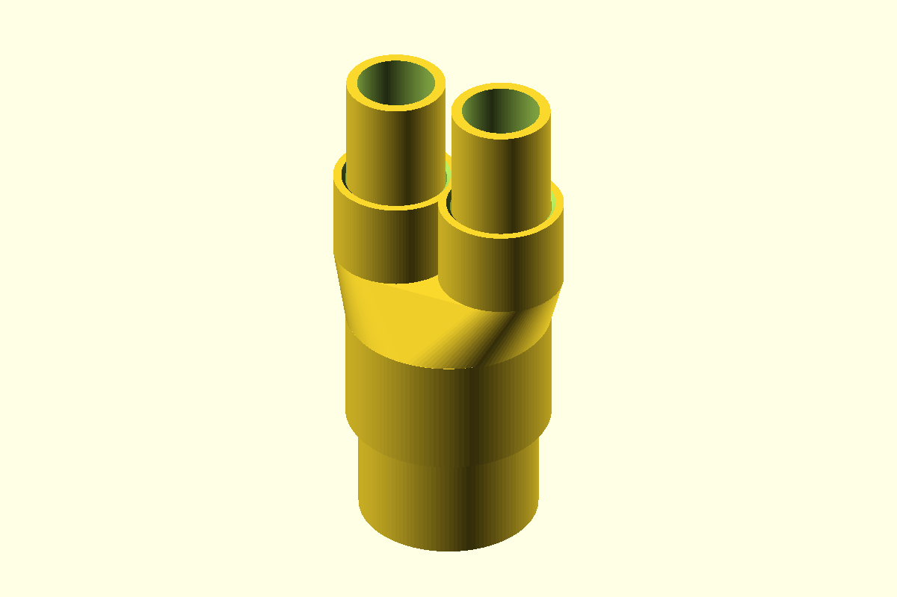

# 1-1/2-Inch to Dual 3/4-Inch PVC Conduit Adapter

A one-piece manifold for Schedule 40 PVC electrical conduit. One female
1-1/2-inch inlet feeds **two female 3/4-inch exits**. All three connections
are unthreaded slip sockets: each conduit inserts into the adapter and
seats against a positive internal stop. A shared tapered chamber connects
all three conduit bores for pulling wire.

## Files

| File | Description |
| --- | --- |
| [`conduit_adapter.scad`](conduit_adapter.scad) | Parametric OpenSCAD source |
| [`adapter.stl`](adapter.stl) | Ready-to-print one-piece manifold |
| [`preview.png`](preview.png) | Assembled render with all three conduits inserted |

## Dimensions and hardware

- 1-1/2-inch socket: fits 48.26 mm (1.900 in) actual conduit OD with
  0.35 mm radial clearance and 32 mm insertion depth.
- Two 3/4-inch sockets: each fits 26.67 mm (1.050 in) actual conduit OD
  with 0.35 mm radial clearance and 24 mm insertion depth.
- Outlet spacing: 31 mm center-to-center.
- Approximate overall size: 64.8 x 55.4 x 72 mm.
- Minimum wall thickness: 3.2 mm.
- Hardware: none.

The default dimensions target Schedule 40 PVC electrical conduit. Nominal
conduit size is not its measured diameter, so measure both pieces before
printing. PVC solvent cement does not reliably weld printed thermoplastic;
use a suitable mechanical retainer or an adhesive/sealant compatible with
both materials.

## Printing

- Print in the modeled orientation with the 1-1/2-inch socket opening flat
  on the build plate and both 3/4-inch sockets pointing upward.
- Supports are not required. The outside reduction and internal passage
  use support-free transitions.
- PETG or ASA is recommended. Use at least four perimeters and 25% infill
  because insertion and cable-pulling loads transfer through the socket
  walls.
- A brim can improve adhesion around the annular first layer.

## Assembly and use

1. Deburr and square both conduit ends.
2. Dry-fit the 1-1/2-inch conduit into the large socket and one 3/4-inch
   conduit into each exit until all three contact their internal stops.
3. Confirm the fit and wire passage before retaining and sealing the joints.
4. Use a compatible mechanical retainer, epoxy, or sealant if the
   installation requires a permanent connection.

This printed fitting is not pressure-rated, watertight-certified, or
electrical-code listed. Use it only where a non-listed transition is
permitted.

## Adjustable parameters

- `pipe15_od`, `pipe34_od`: measured outside diameters of the conduits.
- `pipe15_bore`, `pipe34_bore`: passage diameters at the pipe stops.
- `socket_clearance`: radial fit allowance around both conduits.
- `wall`, `deck_thickness`: socket and manifold strength.
- `engage_depth_15`, `engage_depth_34`: insertion depth for each conduit.
- `port_spacing`: center-to-center spacing between the two exits.
- `transition_height`: height of the support-free manifold transition.
- `lead_in_chamfer`: entry flare at each socket mouth.
- `part`: selects `adapter`, `assembled`, or `cross_section`.
