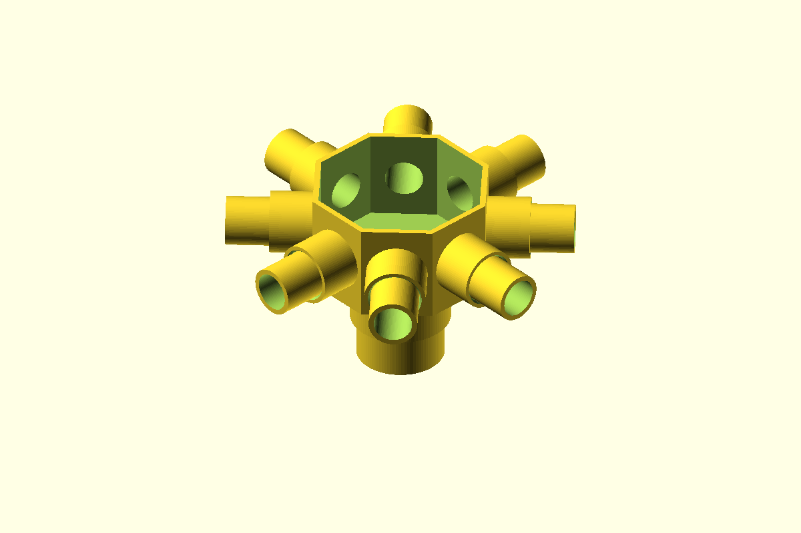

# Octagonal 1-1/2-Inch to Eight 3/4-Inch Conduit Access Box

A one-piece, open-top access box for Schedule 40 PVC electrical conduit.
One female 1-1/2-inch inlet is centered underneath the box. **Eight female
3/4-inch exits point horizontally, with one exit normal to each face of
the octagon.** The open top provides direct access to the shared interior
for routing and pulling wire. Every socket has a positive internal pipe
stop.

## Files

| File | Description |
| --- | --- |
| [`conduit_adapter.scad`](conduit_adapter.scad) | Parametric OpenSCAD source |
| [`access-box.stl`](access-box.stl) | Ready-to-print one-piece access box |
| [`preview.png`](preview.png) | Assembled render with all nine conduits inserted |

## Dimensions and hardware

- Bottom inlet: female 1-1/2-inch socket fitting 48.26 mm (1.900 in)
  actual conduit OD with 0.35 mm radial clearance and 32 mm insertion.
- Eight side exits: female 3/4-inch sockets fitting 26.67 mm (1.050 in)
  actual conduit OD with 0.35 mm radial clearance and 24 mm insertion.
- Interior opening: 88 mm across flats.
- Exterior octagonal body: 94.4 mm across flats and 55 mm tall.
- Overall footprint including opposing side sockets: 144.5 x 144.5 mm.
- Overall height including bottom socket: 87 mm.
- Side exits are centered vertically on every octagonal face.
- Minimum wall: 3.2 mm; solid floor: 4 mm.
- Hardware: none. The access opening intentionally has no lid.

The defaults target Schedule 40 PVC electrical conduit. Nominal conduit
size is not its measured diameter, so measure the conduit before printing.
PVC solvent cement does not reliably weld printed thermoplastic; use a
suitable mechanical retainer or an adhesive/sealant compatible with both
materials.

## Printing

- Print in the modeled orientation with the 1-1/2-inch socket opening flat
  on the build plate and the octagonal access opening facing upward.
- Supports are required beneath the eight horizontal socket bosses and
  inside their horizontal bores. Use supports that can be removed through
  the open top and socket mouths.
- Keep supports out of the bottom socket where practical.
- PETG or ASA is recommended. Use at least four perimeters and 30% infill
  because loads from all nine conduits transfer through the box walls.
- Use a brim around the annular first layer if bed adhesion is marginal.

## Assembly and use

1. Remove all support material from the horizontal sockets and passages.
2. Deburr and square all conduit ends.
3. Insert the 1-1/2-inch conduit upward into the bottom socket until it
   reaches the floor stop.
4. Insert each 3/4-inch conduit horizontally into its side socket until it
   reaches the wall stop.
5. Route wire through the open top and confirm every used conduit opens
   freely into the shared chamber.
6. Cap unused side exits and retain/seal all installed conduit with methods
   compatible with the printed material and installation.

This printed box is not pressure-rated, watertight-certified, or
electrical-code listed. Use it only where a non-listed open access box is
permitted.

## Adjustable parameters

- `pipe15_od`, `pipe34_od`: measured outside diameters of the conduits.
- `pipe15_bore`, `pipe34_bore`: passage diameters at the pipe stops.
- `socket_clearance`: radial fit allowance around all conduits.
- `wall`, `floor_thickness`: box shell and floor strength.
- `engage_depth_15`, `engage_depth_34`: insertion depth for each size.
- `inner_apothem`: center-to-face distance controlling interior size.
- `box_height`: octagonal access-box height.
- `outlet_center_height`: vertical center of the side exits.
- `outlet_stop_thickness`: shoulder depth between each socket and chamber.
- `lead_in_chamfer`: entry flare at each socket mouth.
- `part`: selects `box`, `assembled`, or `cross_section`.
