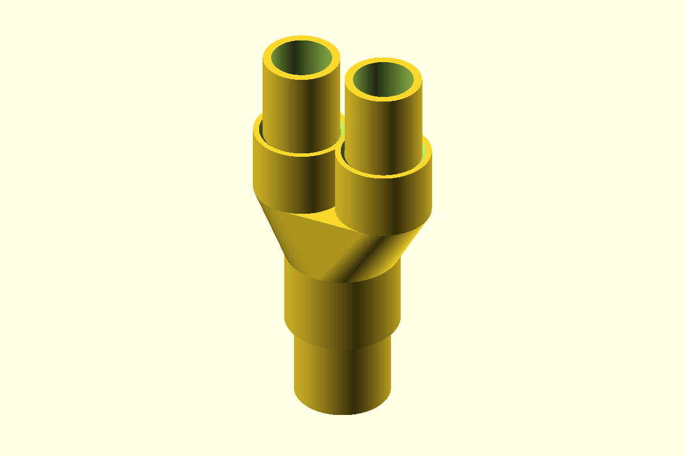

# 1-Inch to Dual 3/4-Inch PVC Conduit Adapter



A one-piece adapter for Schedule 40 PVC electrical conduit: **one female
1-inch inlet feeds two female 3/4-inch outlets**. All three ends are
unthreaded slip sockets with a snug-fit allowance. Each conduit seats
against an internal stop, and a shared tapered chamber connects the three
bores. No additional printed parts or hardware are required.

## Files

| File | Description |
| --- | --- |
| [`conduit_adapter.scad`](conduit_adapter.scad) | Parametric OpenSCAD source |
| [`adapter.stl`](adapter.stl) | Ready-to-print, one-piece adapter |
| [`preview.png`](preview.png) | Assembled view with reference conduit stubs |

The conduit stubs in the preview are references, not printed parts.

## Dimensions and fit

| Feature | Dimension |
| --- | --- |
| 1-inch conduit actual OD | 33.40 mm (approximately 1.315 in) |
| 1-inch female socket ID / insertion depth | 33.70 mm / 28 mm |
| Each 3/4-inch conduit actual OD | 26.67 mm (1.050 in) |
| Each 3/4-inch female socket ID / insertion depth | 26.97 mm / 24 mm |
| Socket fit allowance | 0.15 mm radial, 0.30 mm diametral |
| Outlet center spacing | 31 mm |
| Overall printed size | 64.37 x 40.10 x 74 mm |
| Nominal socket wall / outlet-stop deck thickness | 3.2 mm / 3.2 mm |
| Solid web between outlet sockets | 4.03 mm |
| Transition height | 22 mm |
| Inlet / outlet passage diameter at stops | 26.64 mm / 20.93 mm |

These are **nominal PVC conduit sizes, not measured 1-inch and 3/4-inch
diameters**. This model is not sized for EMT. Measure your actual conduit
outside diameters before printing and update `pipe1_od` and `pipe34_od`
if necessary.

The 0.30 mm diametral allowance targets a snug sliding fit, not a guaranteed
press fit or a tapered solvent-weld joint. Printed holes, material shrinkage,
and conduit tolerances vary. For a quick trial, use the slicer's cut tool
to print a short ring from each socket's straight section. If too tight,
increase `socket_clearance` in 0.05 mm steps and regenerate the STL; if too
loose, reduce it while retaining positive clearance. Do not hammer the
conduit into the printed fitting.

## Printing

- Print as modeled: the single 1-inch socket opens onto the build plate,
  and both 3/4-inch sockets point upward.
- Supports are not required with well-tuned bridging. Both manifold tapers
  stay within 45 degrees; the internal stops have small ledges, and the
  outlet deck bridges the shared chamber (up to about 21 mm across its
  short axis). Orient bridge lines across that short axis, inspect these
  areas in the slicer, and remove any loose strands from the wire passage.
- Use PETG or ASA, at least four perimeters, 25% or greater infill, and
  approximately 0.20 mm layers.
- A brim can help the annular first layer adhere. Avoid elephant's foot
  at the inlet; the entry chamfers help guide insertion.

## Assembly and use

1. Cut all three conduit ends square and deburr the inside and outside.
2. Dry-fit the 1-inch conduit into the lower socket to its 28 mm stop.
3. Insert one 3/4-inch conduit into each upper socket to its 24 mm stop.
4. Confirm the wire passage is smooth and open before pulling any cable.
5. Independently support the conduit and retain/seal joints using a method
   compatible with both the printed material and PVC when required.

PVC solvent cement does not reliably weld PETG or ASA. A snug fit alone
does not provide a certified mechanical connection or a weather seal.

**This printed adapter is not electrical-code listed, pressure-rated, or
certified watertight.** Use a listed fitting for installations that require
one. The 1-inch inlet remains the bottleneck; two outlets do not double the
allowable wire fill.

## Adjustable parameters and inspection

- `pipe1_od`, `pipe34_od`: measured conduit outside diameters.
- `pipe1_bore`, `pipe34_bore`: passage diameters at the pipe stops.
- `socket_clearance`: radial allowance for all three snug sockets.
- `engage_depth_1`, `engage_depth_34`: insertion depths.
- `wall`, `deck_thickness`, `min_stop_width`: socket wall, outlet-stop deck,
  and minimum radial shoulder width.
- `port_spacing`, `transition_height`: outlet spacing and manifold height.
- `lead_in_chamfer`: entry flare height and radial widening.
- `part`: `adapter` for the printable fitting, `assembled` for the fitting
  with conduit references, or `cross_section` to see all three stops and
  the connected wire passage.
- `part="fit_clearance_check"`: intersects the adapter with the inserted
  conduit references. A correct fit produces empty geometry; the references
  are backed off their stops by 0.01 mm to exclude intentional end contact.

Render the fitting and assembled preview after changing dimensions:

```sh
openscad --render -D 'part="adapter"' -o adapter.stl conduit_adapter.scad
openscad --render --autocenter --viewall --projection=ortho --imgsize=1200,800 -D 'part="assembled"' -o preview.png conduit_adapter.scad
```
