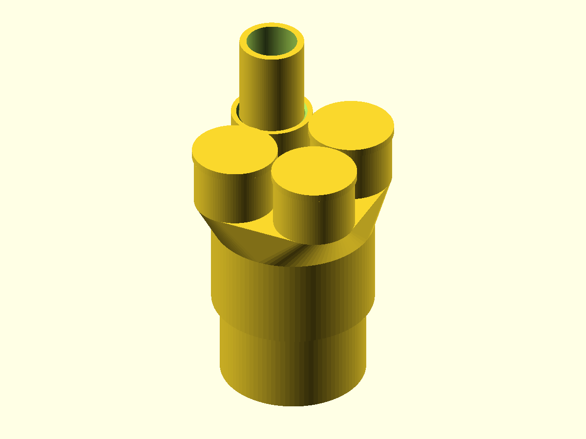

# 2-Inch to Four 3/4-Inch PVC Conduit Adapter

A printable manifold for Schedule 40 PVC electrical conduit. One female
2-inch slip socket feeds four equivalent female 3/4-inch sockets in a
centered 2x2 array, with no outlet in the middle. Use any one for the
current run; included removable plugs close the other three until they are
needed. All outlets share one internal chamber. These are unthreaded
sockets: the conduit ends insert directly into the printed fitting.

## Files

| File | Description |
| --- | --- |
| [`conduit_adapter.scad`](conduit_adapter.scad) | Parametric OpenSCAD source |
| [`adapter.stl`](adapter.stl) | Ready-to-print manifold |
| [`outlet-plug.stl`](outlet-plug.stl) | Removable takeoff plug; print three copies |
| [`preview.png`](preview.png) | One active outlet with the other three capped |

## Dimensions and hardware

- 2-inch inlet: fits 60.325 mm (2.375 in) actual conduit OD with 0.35 mm
  radial clearance and 38 mm insertion depth.
- Four 3/4-inch outlets: each fits 26.67 mm (1.050 in) actual conduit OD
  with 0.35 mm radial clearance and 22 mm insertion depth.
- Outlet layout: centered 2x2 array with 36 mm center-to-center spacing.
- Approximate printed size: 69.8 x 69.8 x 76 mm.
- Minimum nominal socket/deck wall: 3.2 mm.
- Each connection has an internal shoulder that positively stops the pipe.
- Three removable plugs fit the branch sockets with 0.20 mm radial
  clearance and 14 mm insertion depth.
- Hardware: none.

The dimensions target Schedule 40 PVC electrical conduit. Measure actual
pipe before printing because conduit and printer tolerances vary. PVC
solvent cement does not reliably weld printed thermoplastic; use a suitable
mechanical retainer or adhesive/sealant compatible with both materials.

## Printing

- Print `adapter.stl` with the large 2-inch socket opening flat on the
  build plate and the four 3/4-inch sockets pointing upward.
- Print three copies of `outlet-plug.stl`, flange down and stem upward.
- Supports are not required. The outer transition and internal chamber stay
  at or below a 45-degree overhang, and the 3.2 mm deck uses short bridges
  between the four outlet passages.
- PETG or ASA is recommended. Use at least four perimeters and 25% infill
  because all five sockets transfer insertion and cable-pulling loads.
- A brim can improve adhesion around the narrow annular first layer.

## Assembly and use

1. Deburr and square the conduit ends.
2. Insert the 2-inch conduit into the lower socket and the primary
   3/4-inch conduit into any one of the four upper sockets until each
   reaches its internal stop.
3. Press one printed plug into each of the three unused sockets.
4. To add a run later, remove one plug and replace it with 3/4-inch conduit.
5. Confirm every run opens into the common chamber before pulling cable.
6. Retain and seal the pipes with a method compatible with the printed
   material and the installation.

This printed fitting is not pressure-rated, watertight-certified, or
electrical-code listed. Use it only where a non-listed transition is
permitted, such as a protected, accessible low-stress installation.

## Adjustable parameters

- `pipe2_od`, `pipe34_od`: actual outside diameters of the mating conduit.
- `pipe2_bore`, `pipe34_bore`: passage diameters and pipe-stop openings.
- `socket_clearance`: radial fit allowance around every conduit.
- `wall`, `deck_thickness`: socket and manifold strength.
- `engage_depth_2in`, `engage_depth_34in`: pipe insertion depths.
- `port_spacing`: center-to-center spacing of the 2x2 outlet array.
- `plug_fit_clearance`, `plug_insertion_depth`: removable plug fit.
- `plug_flange_thickness`, `plug_flange_overhang`: plug stop flange.
- `transition_height`: height of the support-free manifold shoulder.
- `lead_in_chamfer`: entry flare at each socket mouth.
- `part`: selects `adapter`, `plug`, `layout`, `assembled`, `expanded`, or
  `cross_section`.
