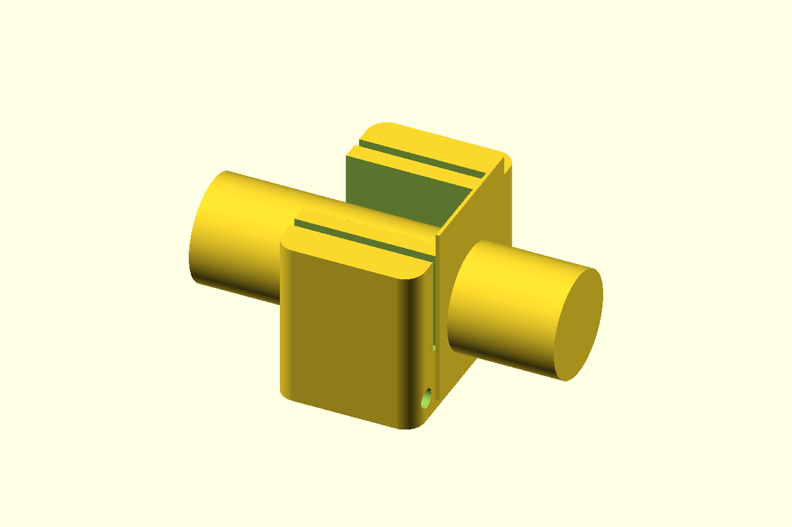

# One-Piece 3/4-Inch PVC Conduit Cutting Jig

A one-piece saw jig that snaps onto 3/4-inch Schedule 40 PVC electrical conduit. Its flat end face holds an oscillating multi-tool blade perpendicular to the tube, while two flexible jaws retain the jig without loose hardware.

## Files

| File | Description |
| --- | --- |
| [`pvc_conduit_snap_cutting_jig.scad`](pvc_conduit_snap_cutting_jig.scad) | Parametric OpenSCAD source |
| [`jig.stl`](jig.stl) | Ready-to-print one-piece snap-on jig |
| [`preview.png`](preview.png) | Render with conduit and blade references |

## Dimensions and hardware

- Conduit: 3/4-inch PVC Schedule 40, 26.67 mm nominal outside diameter
- Jig: 36 x 56 x 42 mm
- Guide: flat end face with a 1.5 mm tooth-clearance recess
- Retention throat: 23.2 mm with two flexible jaws
- Safety tether hole: 5 mm
- Hardware: none
- Recommended blade: 32-35 mm wide with at least 35 mm cutting depth

## Printing

- Print `jig.stl` in its modeled orientation, standing on the flat guide face.
- The conduit axis is vertical, placing each flexible-jaw profile within the XY layers rather than across layer bonds.
- No supports are required.
- PETG is recommended for the flexible fingers; use at least four walls and 30% infill.
- A 6-8 mm brim is recommended for stability; keep it off the inner conduit channel.

## Assembly and use

1. Attach a wrist cord or tool tether through the 5 mm corner hole.
2. Align the conduit with the open channel and press the jig on until both jaws snap over it.
3. Hold the flat side of the oscillating blade against the recessed guide face.
4. Cut flush to that face without forcing the blade into the printed plastic.
5. Pull the jig straight off the tube after the cut.

The shallow recess gives the blade teeth clearance while the blade body rides on the surrounding square face. Treat the jig as sacrificial and replace it if the guide face becomes damaged. Wear eye protection and maintain three points of contact on a ladder; do not hold the conduit with the hand that supports your balance.

## Adjustable parameters

- `conduit_outer_diameter`: measured conduit outside diameter
- `radial_clearance`: fit allowance around the conduit
- `entry_throat_width`: snap retention and insertion force
- `cut_face_relief_depth`: clearance behind the guide face for blade teeth
- `cut_face_tooth_clearance`: radial size of the tooth-clearance recess
- `jaw_relief_width` and `jaw_relief_center`: finger flexibility
- `body_length`, `body_width`, and `body_height`: overall jig size
- `part`: selects `jig` or `preview`
