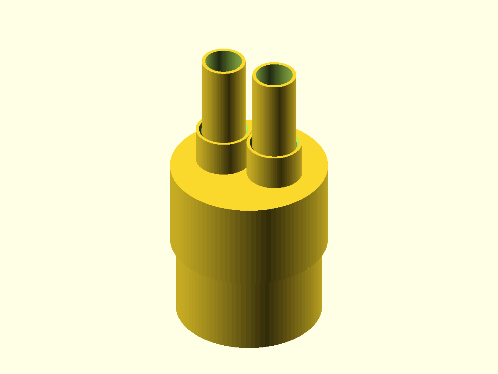

# 3-Inch to Dual 3/4-Inch PVC Conduit Adapter

A single-piece cap-style adapter for Schedule 40 PVC electrical conduit. It slips over the outside of a 3-inch conduit end and provides two 3/4-inch sockets on its face, letting two runs of 3/4-inch conduit transition into one 3-inch conduit. All three bores are joined into one open manifold cavity so wire/cable passes freely between the 3-inch run and either 3/4-inch run.

Both connections are **female** (sockets): the adapter slips over the **outside** of the 3-inch pipe, and the 3/4-inch pipes insert **into** the adapter's two bosses.

## Files

| File | Description |
| --- | --- |
| [`conduit_adapter.scad`](conduit_adapter.scad) | Parametric OpenSCAD source |
| [`printable-part.stl`](printable-part.stl) | Ready-to-print one-piece adapter |
| [`preview.png`](preview.png) | Render with mock conduit stubs inserted for fit reference |

## Dimensions and hardware

- 3-inch side: Schedule 40 PVC conduit, 88.90 mm (3.500 in) nominal outside diameter. Adapter slips over this OD with ~0.35 mm radial clearance and 45 mm of engagement depth.
- 3/4-inch side (x2): Schedule 40 PVC conduit, 26.67 mm (1.050 in) nominal outside diameter. Each socket accepts a 3/4-inch pipe end with ~0.35 mm radial clearance and 22 mm of engagement depth.
- Port spacing: 34 mm center-to-center between the two 3/4-inch sockets.
- Wall thickness: 3.2 mm around each socket; 9 mm total face plate between the 3-inch cavity and the 3/4-inch bosses, made up of a 3.2 mm solid top deck over a recessed internal manifold chamber that lets wire route from the 3-inch bore into either 3/4-inch bore.
- Hardware: none required. Schedule 40 solvent cement does not reliably bond to printed plastic — treat the joints as friction-fit, and seal/retain them with silicone sealant, epoxy, or hose clamps rather than relying on a code-rated solvent weld.

## Printing

- Print in the modeled orientation: 3-inch socket opening down on the print bed, 3/4-inch bosses pointing up.
- No supports are required; all overhangs are vertical walls or the socket lead-in chamfers.
- Use PETG or ASA for outdoor/electrical-box durability; at least 3 perimeters and 20% infill is recommended given the socket walls carry insertion/retention loads.
- If a printed socket fits too tight or too loose over the actual conduit, adjust `socket_clearance` (in the `.scad` file) by roughly the amount of interference/slop measured and re-slice.

## Assembly and use

1. Dry-fit the 3-inch conduit into the open bottom socket and each 3/4-inch conduit into the top bosses; confirm all three seat to their full engagement depth without binding.
2. If a permanent joint is needed, rough up the mating pipe surfaces and bond with an adhesive compatible with both the pipe and the printed material (e.g., PVC-safe epoxy) rather than PVC solvent cement.
3. Pull wires/cable through the 3-inch opening, through the shared internal manifold, and out either 3/4-inch port.
4. This fitting is not pressure- or code-rated; use it only as a wire-pass transition in low-stress, accessible locations (e.g., inside an enclosure or junction box), not as a substitute for a rated conduit body where code requires one.

## Adjustable parameters

- `pipe3_od`, `pipe34_od`: reference OD of the mating conduit sizes (Schedule 40 nominal values by default)
- `socket_clearance`: radial clearance added to each socket ID over the mating pipe OD
- `wall`: shell wall thickness around each socket
- `cap_face_thickness`: total face plate thickness separating the 3-inch cavity from the 3/4-inch bosses (solid deck + internal manifold gap)
- `deck_thickness`: solid top deck thickness left above the internal manifold chamber (must be less than `cap_face_thickness`)
- `engage_depth_3in`, `engage_depth_34in`: how far each pipe size inserts into its socket
- `port_spacing`: center-to-center distance between the two 3/4-inch sockets
- `lead_in_chamfer`: size of the flared lead-in at each socket mouth
- `part`: selects `adapter` (printable part), `assembled` (adapter with mock conduit stubs for fit-check), or `cross_section` (assembled view cut in half to inspect the internal manifold)
