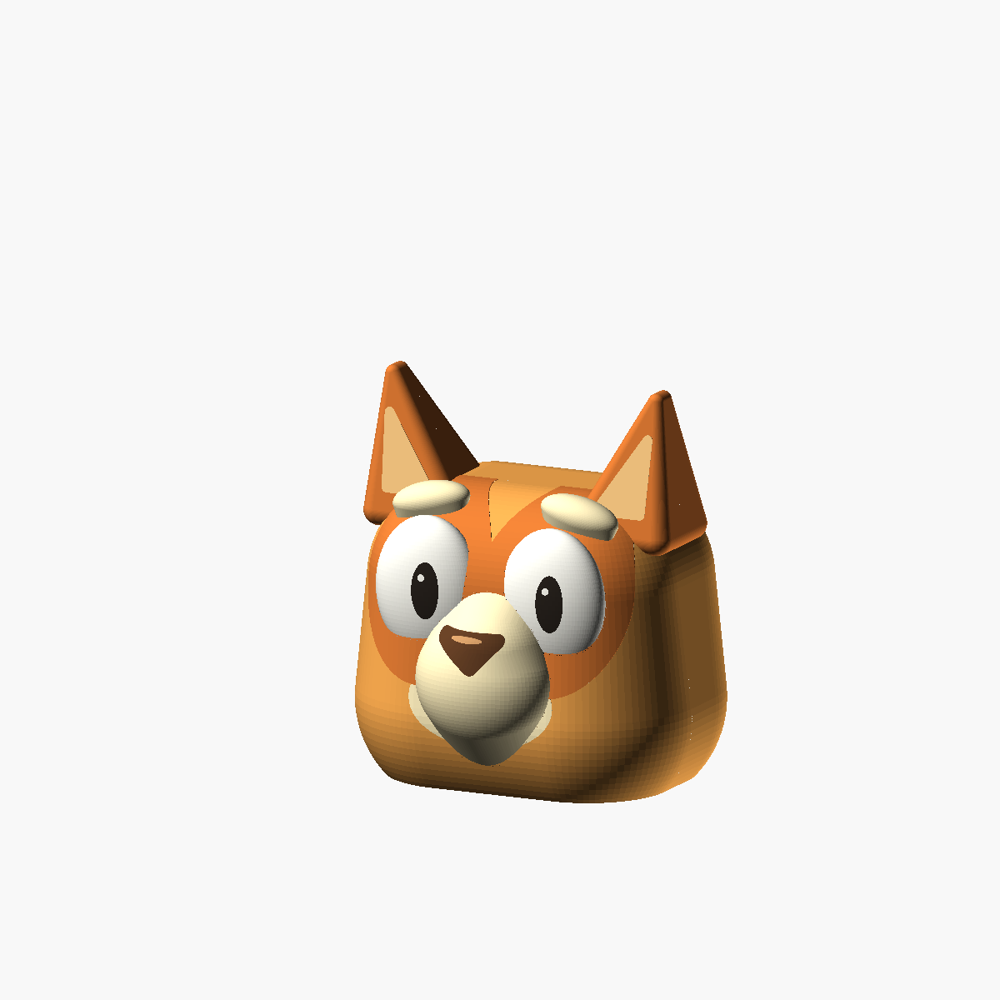
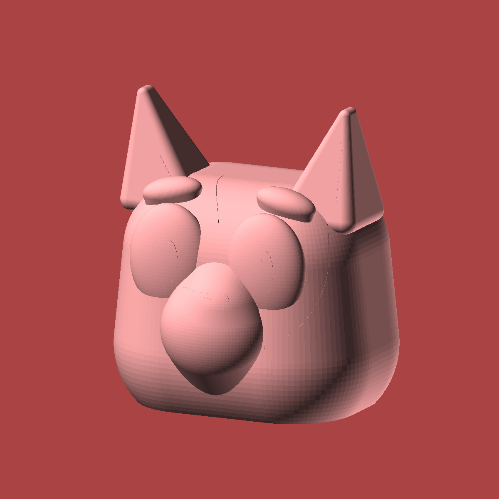

# Bingo head lantern





A Bingo-inspired companion to the
[rounded Bluey V3 head](../bluey-head-lantern/v3-no-smile/). It keeps the
rounded cheeks, flat print base, shallow modeled face details, and continuous
muzzle blends, with a smaller head, shorter ears, narrower snout, rounded
orange eye patches, cream brows and muzzle, and a brown nose. The crown is
smooth without Bluey's forehead tuft.

Like the source V3, this is a **single-piece, no-smile solid master**. It has
no mouth line, separate cap, joint, hook, or hanging hardware. The Bluey
variants are unchanged; this source is self-contained and does not import
them, so either project can be downloaded independently.

## Files and dimensions

| File | Purpose |
| --- | --- |
| [bingo_head_lantern.scad](bingo_head_lantern.scad) | Parametric OpenSCAD source |
| [head.stl](head.stl) | Complete one-piece head, flat-base-down |
| [preview.png](preview.png) | Fully rendered geometry |
| [color-guide.png](color-guide.png) | Suggested paint colors on the actual geometry |

The head is approximately **136 W x 124 D x 155 H mm**, including ears and
the projecting muzzle. The flat rounded footprint is approximately
**113.5 x 85.5 mm**. The crown is 114 mm above the base; the ear-tip centers are
152 mm high and their rounded ends extend above that.

This is a stylized sculpt derived from the existing Bluey model, not an exact
on-screen scale match. The STL contains no colors. Colors in OpenSCAD and the
color guide are painting suggestions, not separate multi-material parts.

## Printing

Print with the **flat underside on the bed and ears pointing upward**, as
exported. A brim is useful. Light-colored or natural/translucent filament is
a useful starting point for a lantern; opaque orange or cream paint reduces
light transmission.

The STL is solid so that hollowing and wall thickness remain under slicer
control. Zero infill alone does not create an underside opening or remove
bottom skins. For a hollow lantern:

- Start with a 0.4 mm nozzle, 0.16-0.20 mm layers, at least two 0.45 mm walls,
  and 0% infill, then adjust to your printer and material.
- Keep enough top skins to close the crown and ears. This is the complete
  head, not the open-topped body of a two-piece design.
- Use the slicer's open-base/hollowing settings or remove the bottom skins
  to leave access for the LED and support removal.
- **Use removable supports beneath the broad inner crown** and any facial or
  ear overhangs flagged by the slicer. Do not limit supports to the build
  plate if this leaves upper internal surfaces unsupported.
- Inspect the sliced layers and ensure supports can be removed through the
  underside before installing a light.

This is **not support-free or vase mode**. The shallow facial relief and
blended muzzle do not eliminate the hollow crown's need for support.
A decorative solid print can instead use normal infill; inspect its exterior
overhangs as well. The model has not been physically printed.

## Hardware, assembly, and lighting

There is one printed object and no required screws, glue, or assembly.
No light holder, base cover, or load-rated hanging attachment is included.
Provide your own LED retention and any hanging attachment to suit the final
shell, and remove all internal support before installing the light.

**Use a cool-running, self-contained battery LED only.** No candles, flame,
hot bulbs, or mains lamp holders. Use an enclosed battery compartment, keep
batteries and small parts away from children, and check the temperature and
attachment security before use.

## Adjustable parameters

Dimensions are in millimeters and grouped near the top of the source.

| Parameter | Default | Purpose |
| --- | --- | --- |
| `part` | `"assembled"` | `head`, `assembled`, `layout`, or diagnostic `section` |
| `head_width`, `head_depth` | `136`, `108` | Main rounded body dimensions |
| `cheek_radius`, `cheek_center_z` | `43`, `29` | Rounded cheeks and flat-base intersection |
| `crown_height`, `crown_radius` | `114`, `38` | Crown height and curvature |
| `forehead_width`, `forehead_depth` | `126`, `100` | Upper head dimensions |
| `ear_root_height`, `ear_tip_height` | `100`, `152` | Shorter ear root and tip-center heights |
| `ear_root_inner`, `ear_root_outer`, `ear_tip_x` | `28`, `58`, `55` | Ear width and outward lean |
| `eye_spacing`, `eye_size` | `52`, `[43, 20, 56]` | Eye centers and full ellipsoid dimensions |
| `eye_patch_margin` | `[8, 10]` | Orange patch growth beyond the eye silhouette |
| `muzzle_y`, `muzzle_depth` | `-50`, `20` | Forward placement and half-depth of the snout |
| `muzzle_root_bottom`, `muzzle_root_top` | `5`, `90` | Lower and upper muzzle-blend endpoints |
| `brow_z`, `brow_root_z` | `109`, `99` | Brow top volume and blended root heights |
| `detail_relief` | `0.2` | Shallow raised marking steps |
| `coat_color`, `patch_color`, `cream_color`, `nose_color` | Orange, dark orange, cream, brown | Preview palette; does not color the STL |
| `$fn` | `96` | Curved-surface resolution |

`head`, `assembled`, and `layout` show the same complete, single-piece model.
`section` removes the back half for inspection and is not a printable part or
a simulation of slicer hollowing. Large proportion changes require reviewing
the facial placement, ear attachment, and resulting slice.

## Regeneration

Run from this folder:

```sh
openscad --hardwarnings --render --autocenter --viewall --projection=ortho --camera=220,-460,200,0,0,78 --imgsize=1200,1200 --colorscheme=Sunset -D 'part="head"' -o head.stl -o preview.png bingo_head_lantern.scad
openscad --hardwarnings --preview --autocenter --viewall --projection=ortho --camera=220,-460,200,0,0,78 --imgsize=1200,1200 --colorscheme=Tomorrow -D 'part="assembled"' -o color-guide.png bingo_head_lantern.scad
```

## References

The rounded construction is adapted from this repository's Bluey V3 model.
[Bingo's official character page](https://www.bluey.tv/characters/bingo/)
informs the orange and cream palette, brown nose, eye patches, and ear styling.
No reference photographs, character artwork, or externally sourced printable
meshes are included. This is an unofficial fan-made model, not an official
Bluey product.
