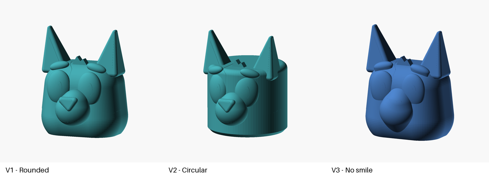

# Bluey head lantern - three variants

One project with three independent variants of the Bluey-inspired head.
Each variant retains its original OpenSCAD source, printable STL, rendered
preview, color guide, and detailed printing instructions. Consolidation changes
the folder layout only; the existing geometry and print artifacts are unchanged.

## Choose a variant

| Variant | Shape | Approximate W x D x H | Printable STL | Editable source |
| --- | --- | --- | --- | --- |
| [V1 - rounded](v1-rounded/) | Soft rounded cheeks and crown, raised face details and smile | 144 x 142 x 184.2 mm | [head.stl](v1-rounded/head.stl) | [OpenSCAD](v1-rounded/bluey_head_lantern.scad) |
| [V2 - circular](v2-circular/) | Cylindrical head with a circular base and smile | 144 x 169.2 x 184.2 mm | [head.stl](v2-circular/head.stl) | [OpenSCAD](v2-circular/bluey_circular_head.scad) |
| [V3 - no smile](v3-no-smile/) | Rounded V1-style body, no mouth line, gentler facial blends | 144 x 130.1 x 184.1 mm | [head.stl](v3-no-smile/head.stl) | [OpenSCAD](v3-no-smile/bluey_no_smile.scad) |

Choose one variant to print; these are alternatives, not three parts to assemble.
The overview image uses each variant's existing preview with its original camera
angle and framing, so the images are not a dimensional comparison.

## Files

Each variant folder contains `README.md`, its self-contained `.scad` source,
`head.stl`, `preview.png`, and `color-guide.png`. The V1 folder also preserves
the pre-existing `headv1.stl` as a legacy artifact; use `head.stl` for the
documented current V1 model. The project-level `preview.png` compares all three
variants.

## Printing, hardware, and assembly

All three are single-piece **solid masters**, exported with the flat base on
the bed and ears upward. A brim is useful. There are no separate printed pieces
to assemble, no required screws or adhesive, and no included hook, light holder,
or hanging hardware.

For lantern use, choose hollowing, walls, and an accessible underside opening
in your slicer. Zero infill alone does not remove the bottom skins.
**Supports are required when printing hollow**, particularly beneath the broad
crown and projecting features. Leave enough access to remove internal supports
before installing a light. These are not support-free or vase-mode lanterns.
Follow the selected variant's README for its specific settings and limitations.

Use a **cool-running, self-contained battery LED only**, never a candle, hot
bulb, or mains lamp holder. Provide your own appropriate LED retention and any
hanging attachment. The models have not been physically printed or load-tested.

## Editing and regeneration

Open the source inside the chosen variant folder. All sources retain a `part`
selector: `head`, `assembled`, and `layout` show the same single-piece head;
`section` is a diagnostic cutaway, not a printable part.

V1 and V3 expose rounded-body dimensions such as `head_width`, `head_depth`,
`cheek_radius`, and `crown_height`. V2 uses `head_radius`, `base_radius`,
`base_bevel_height`, and `top_edge_radius` for its cylindrical body. Ear and
facial parameters are documented in each variant README.

Run regeneration commands from the corresponding variant folder so its source,
STL, and previews stay together. Changing one variant does not change the others.

These are unofficial fan-made models. Each variant README retains its original
visual references and attribution.
