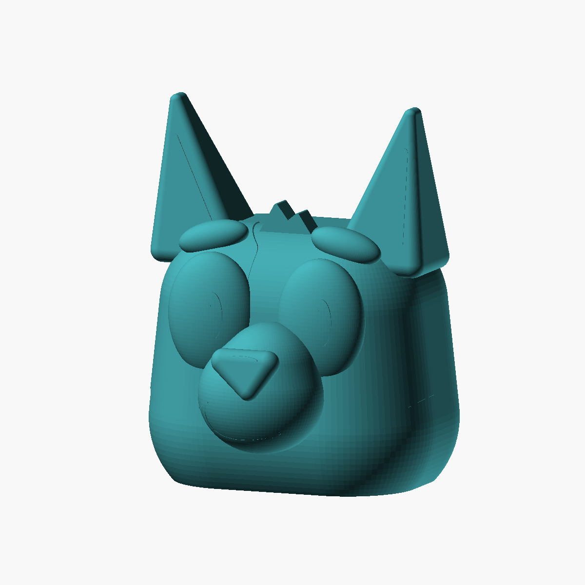
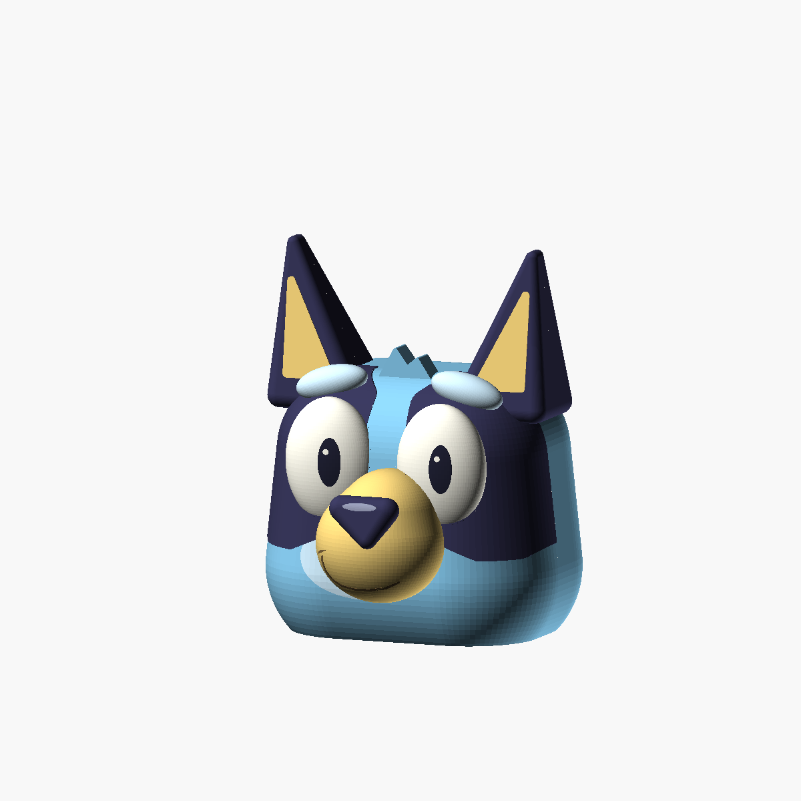

# Bluey head lantern sculpt - final V1





This is the preserved **V1** shape in the [three-variant project](../).
The [V2 circular-base variant](../v2-circular/) uses a cylindrical,
LEGO-like head body without changing this sculpt.

A smooth, rounded Bluey-inspired head with a flat underside that gradually
curves outward into full cheeks. The shape takes cues from three-dimensional
amigurumi toys, **without crochet, yarn, stitch, or fabric texture**. The cheeks,
back, and crown are softly rounded rather than a box with small corner fillets.

The tall pointed ears and inner-ear panels, dark eye patches, oval eyes,
raised pupils and highlights, eyebrows, forehead tuft, projecting rounded
muzzle, rounded triangular nose, and curved smile are actual geometry.
The subtle raised markings also provide painting guides on a single-color print.

**This is a solid master sculpt.** Hollowing, wall thickness, and perimeter
count are left to the slicer rather than fixed in the CAD. There is **no hook,
hook mount, tray, or attachment hardware**; lighting and hanging attachments
can be added to suit the finished print.

## Files and dimensions

| File | Purpose |
| --- | --- |
| [bluey_head_lantern.scad](bluey_head_lantern.scad) | Parametric OpenSCAD source |
| [head.stl](head.stl) | Complete single-piece solid head, already flat-bottom-down |
| [headv1.stl](headv1.stl) | Pre-existing legacy V1 STL, preserved unchanged; use `head.stl` for the current documented model |
| [preview.png](preview.png) | Fully rendered geometry |
| [color-guide.png](color-guide.png) | Color preview / suggested paint boundaries |

The head is approximately **144 mm wide x 142 mm deep x 184.2 mm tall**,
including the projecting nose and ears. The crown between the ears is
approximately 124 mm above the base. The STL does not contain color information;
the color guide illustrates optional painting, not separate color-print parts.

## Printing and lantern use

Print with the **flat underside on the bed and ears pointing upward**, as
exported. A brim is useful. Translucent/natural or light-blue filament is a
good starting point for an illuminated print; opaque paints reduce light output.

Set hollowing and walls in your slicer. Make sure the resulting slice has an
accessible underside opening for installing the LED: zero infill by itself
does not remove bottom skins. Use the slicer's hollow/open-base controls or
remove the bottom skins as appropriate for that slicer, and inspect the layer
preview. The supplied solid master intentionally has no pre-cut internal
cavity or fixed shell thickness.

**Supports are required** under the projecting muzzle/eyebrows and for the
broad crown when printed hollow. Use removable supports and keep an opening
large enough to remove internal support before installing a light. This is
not a support-free or vase-mode design. Layer height, wall count, and other
material settings are intentionally left to the printer and slicer profile.

There are no printed parts to assemble and no required fasteners. Add your own
LED retention and hanging attachment after choosing the final shell settings.
The model has not been physically printed or load-tested.

**Use a cool-running, self-contained battery LED only.** No candles, flames,
hot bulbs, or mains lamp holders. Keep batteries and small attachments away
from children. Check enclosure temperature and attachment security before use.

## Adjustable parameters

Dimensions are in millimeters and are grouped at the top of the source.

| Parameter | Default | Purpose |
| --- | --- | --- |
| `part` | `"assembled"` | `head`, `assembled`, `layout`, or `section` |
| `head_width`, `head_depth` | `144`, `112` | Main head volume before facial projections |
| `cheek_radius`, `cheek_center_z` | `45`, `30` | Broad, rounded cheeks and their rise from the flat base |
| `crown_radius`, `crown_height` | `40`, `124` | Soft crown curvature and height |
| `forehead_width`, `forehead_depth` | `132`, `104` | Upper head proportions |
| `ear_tip_height` | `181` | Ear-tip sphere-center height; the rounded tips extend above it |
| `eye_spacing`, `eye_size` | `56`, `[44, 24, 60]` | Eye placement and 3D proportions |
| `pupil_look_x` | `4` | Shared horizontal gaze offset |
| `muzzle_y`, `nose_y` | `-57`, `-78` | Forward projection; front is negative Y |
| `detail_relief` | `0.45` | Shallow raised face markings, not surface texture |
| `$fn` | `96` | Curved-surface tessellation |

`head`, `assembled`, and `layout` show the same one-piece head. `section`
removes its back half for inspection; it is a diagnostic view, not a print part.
Large proportion changes require a fresh visual inspection because the facial
features are sculpted for the default head dimensions.

## Regeneration

Run from this folder:

```bash
openscad --hardwarnings --render --autocenter --viewall --projection=ortho --camera=180,-450,170,0,0,90 --imgsize=1200,1200 --colorscheme=Tomorrow -D 'part="assembled"' -o head.stl -o preview.png bluey_head_lantern.scad
openscad --hardwarnings --preview --autocenter --viewall --projection=ortho --camera=180,-450,170,0,0,90 --imgsize=1200,1200 --colorscheme=Tomorrow -D 'part="assembled"' -o color-guide.png bluey_head_lantern.scad
```

## Visual references

Original OpenSCAD geometry developed using several references, without an
imported printable mesh:

- [Official Bluey character artwork](https://www.bluey.tv/characters/bluey/):
  ears, facial markings, eye proportions, nose, and muzzle.
- [Hello Stitches XO amigurumi photographs](https://hellostitchesxo.com.au/bluey-amigurumi-free-pattern/):
  rounded three-quarter head form, dimensional eyebrows, and projecting muzzle.
- [Bellota Arte amigurumi photographs via All Amigurumi](https://allamigurumi.com/crochet-bluey-amigurumi/):
  a second rounded front-view interpretation and facial placement.

The crochet references inform the 3D form only, not the texture or construction
pattern. Reference photographs are not included. This is an unofficial fan-made
model, not an official Bluey product.
