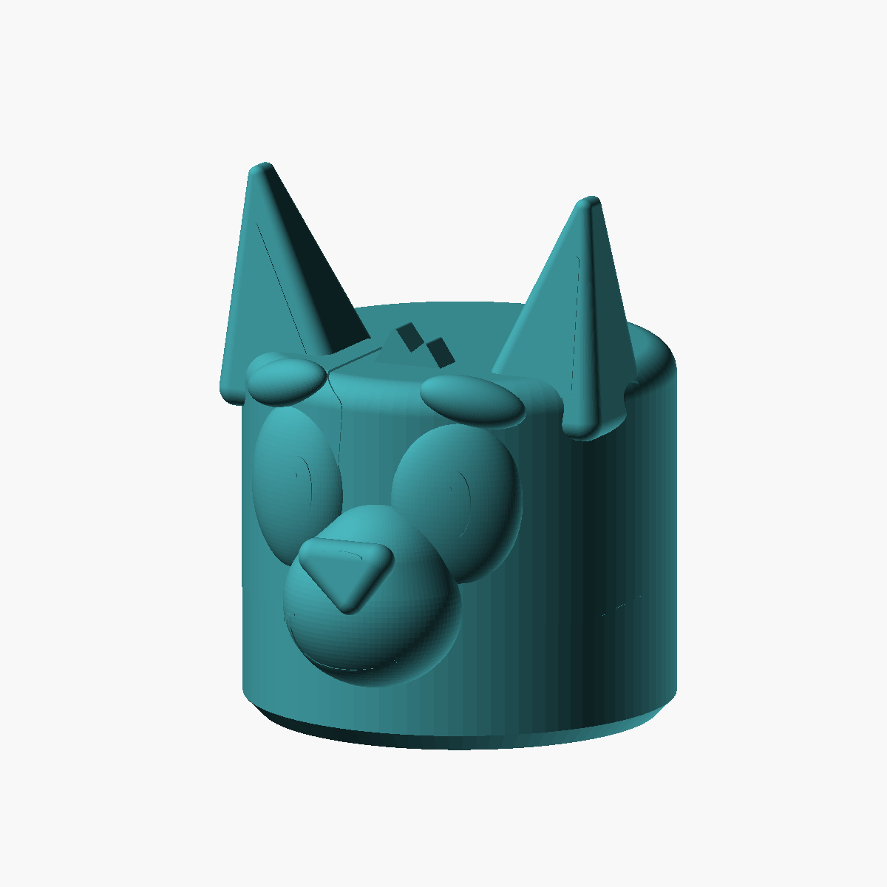
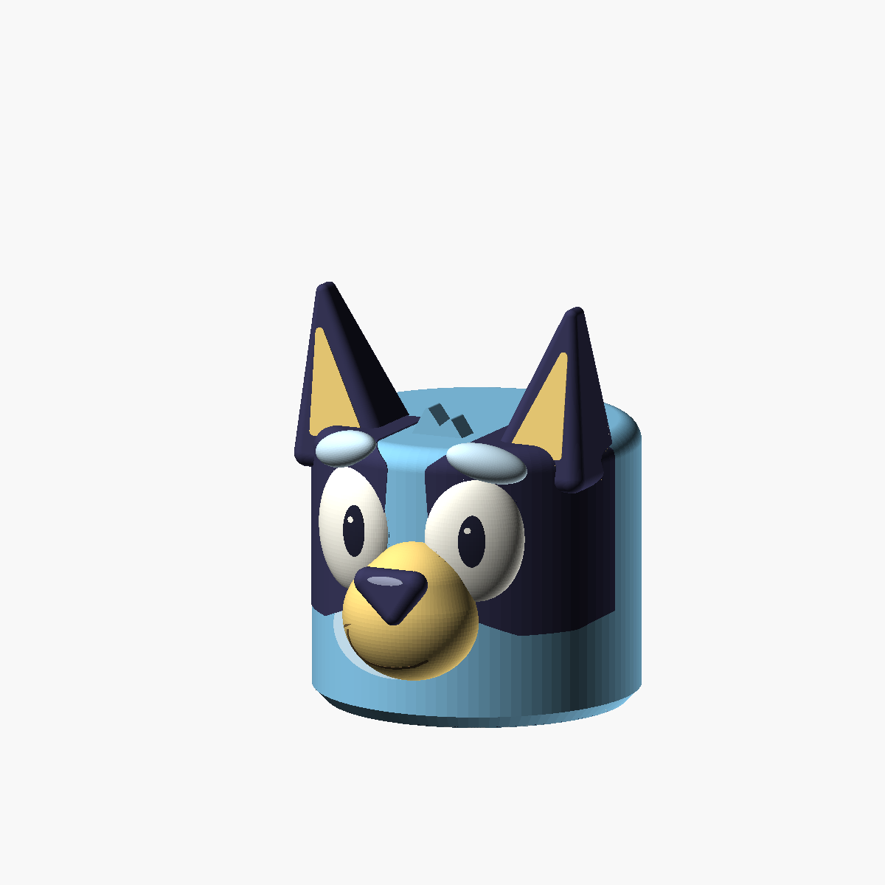

# Bluey circular head lantern sculpt - V2





A **V2** in the [three-variant project](../), with a circular flat base and a cylindrical, LEGO-like head
body. This changes the head itself into a cylinder; it is not a round pedestal
under the old shape. The softly rounded **[final V1](../v1-rounded/)**
is preserved unchanged.

The circular body has a gentle lower bevel and a rounded top edge. Bluey's ears,
inner-ear panels, facial patches, oval eyes, pupils and highlights, eyebrows,
forehead tuft, projecting rounded muzzle, triangular rounded nose, and smile
remain three-dimensional details. The eyes and brows turn slightly around the
cylinder to follow its curved face.

Both variants have a **smooth surface with no crochet or fabric texture**.
This is a **solid master**: hollowing and wall settings are left to your slicer.
There is **no hook or hanging mount**. The LEGO comparison describes the
cylindrical silhouette, not a stud or a compatible toy connector.

## Files and dimensions

| File | Purpose |
| --- | --- |
| [bluey_circular_head.scad](bluey_circular_head.scad) | Self-contained V2 source; does not import or modify V1 |
| [head.stl](head.stl) | Complete one-piece solid head, flat-base-down |
| [preview.png](preview.png) | Fully rendered geometry |
| [color-guide.png](color-guide.png) | Suggested paint colors on the actual sculpt |

| Dimension | Nominal value |
| --- | --- |
| Circular base diameter | 132 mm |
| Main cylindrical body diameter | 144 mm |
| Base bevel | 6 mm outward rise over 6 mm height |
| Crown height, excluding ears | 124 mm |
| Top-edge radius | 10 mm |
| Overall envelope, including face and ears | Approximately 144 W x 169.2 D x 184.2 H mm |

The face projects forward above the base; it does not alter the circular
footprint at the print plane. The STL is single-material and contains no color
information. Use the color guide for painting or slicer painting if desired.

## Printing and lantern use

Print with the **circular flat base on the bed and the ears pointing upward**,
as exported. A brim is useful. The lower bevel rises at 45 degrees. Use
translucent/natural or light-blue filament for an illuminated print.

Choose hollowing, wall count, and material settings in the slicer. Ensure the
finished slice has an accessible underside opening for installing an LED:
zero infill alone does not remove bottom skins. Use hollow/open-base controls
or remove the bottom skins as appropriate for your slicer. The CAD intentionally
does not impose a fixed wall thickness.

**Supports are required** for the projecting face/eyebrows and the broad crown
when printing hollow. Keep an opening large enough to remove internal supports
before installing a light. This is not a support-free or vase-mode design.
Inspect the sliced layers, particularly the roof and ear roots.

There are no separate printed pieces to assemble and no required fasteners.
Add your own LED retention and hanging hardware to suit the final shell.
The model has not been physically printed or load-tested.

**Battery LED only:** use a cool-running, self-contained light with an enclosed
battery compartment. No candles, flames, hot bulbs, or mains lamp holders.
Check enclosure temperature and attachment security before use, and keep
batteries and small parts away from children.

## Adjustable parameters

| Parameter | Default | Purpose |
| --- | --- | --- |
| `part` | `"assembled"` | `head`, `assembled`, `layout`, or `section` |
| `head_radius` | `72` | Cylindrical body radius |
| `base_radius` | `66` | Radius of the circular bed-contact face |
| `base_bevel_height` | `6` | Height of the outward transition to the cylinder |
| `crown_height` | `124` | Height of the flat crown |
| `top_edge_radius` | `10` | Rounded upper edge |
| `ear_tip_height`, `ear_y` | `181`, `-16` | Ear height and forward placement |
| `eye_spacing`, `eye_size` | `56`, `[44, 24, 60]` | Eye spacing and 3D proportions |
| `eye_wrap_angle` | `22` | Degrees each eye/brow turns around the curved face |
| `pupil_look_x` | `4` | Shared horizontal gaze offset |
| `muzzle_y`, `nose_y`, `brow_y` | `-68`, `-89`, `-61` | Forward placement; front is negative Y |
| `detail_relief` | `0.45` | Raised facial markings, not texture |
| `$fn` | `96` | Curve tessellation |

All dimensions are millimeters unless noted. `head`, `assembled`, and `layout`
show the same one-piece sculpt. `section` is an inspection view with the back
half removed, not a print part. Major diameter/proportion changes need a fresh
visual inspection and corresponding facial-placement adjustments.

## Regeneration

Run from this folder:

```bash
openscad --hardwarnings --render --autocenter --viewall --projection=ortho --camera=220,-460,200,0,0,88 --imgsize=1200,1200 --colorscheme=Tomorrow -D 'part="assembled"' -o head.stl -o preview.png bluey_circular_head.scad
openscad --hardwarnings --preview --autocenter --viewall --projection=ortho --camera=220,-460,200,0,0,88 --imgsize=1200,1200 --colorscheme=Tomorrow -D 'part="assembled"' -o color-guide.png bluey_circular_head.scad
```

## Visual references

V2 keeps the same original sculpted features and reference set as V1:
[official Bluey artwork](https://www.bluey.tv/characters/bluey/),
[Hello Stitches XO's amigurumi photographs](https://hellostitchesxo.com.au/bluey-amigurumi-free-pattern/),
and [Bellota Arte's amigurumi photographs via All Amigurumi](https://allamigurumi.com/crochet-bluey-amigurumi/).
The crochet examples inform the three-dimensional form, not the texture or
construction pattern. No reference photographs or imported printable meshes
are included. This is an unofficial fan-made model.
