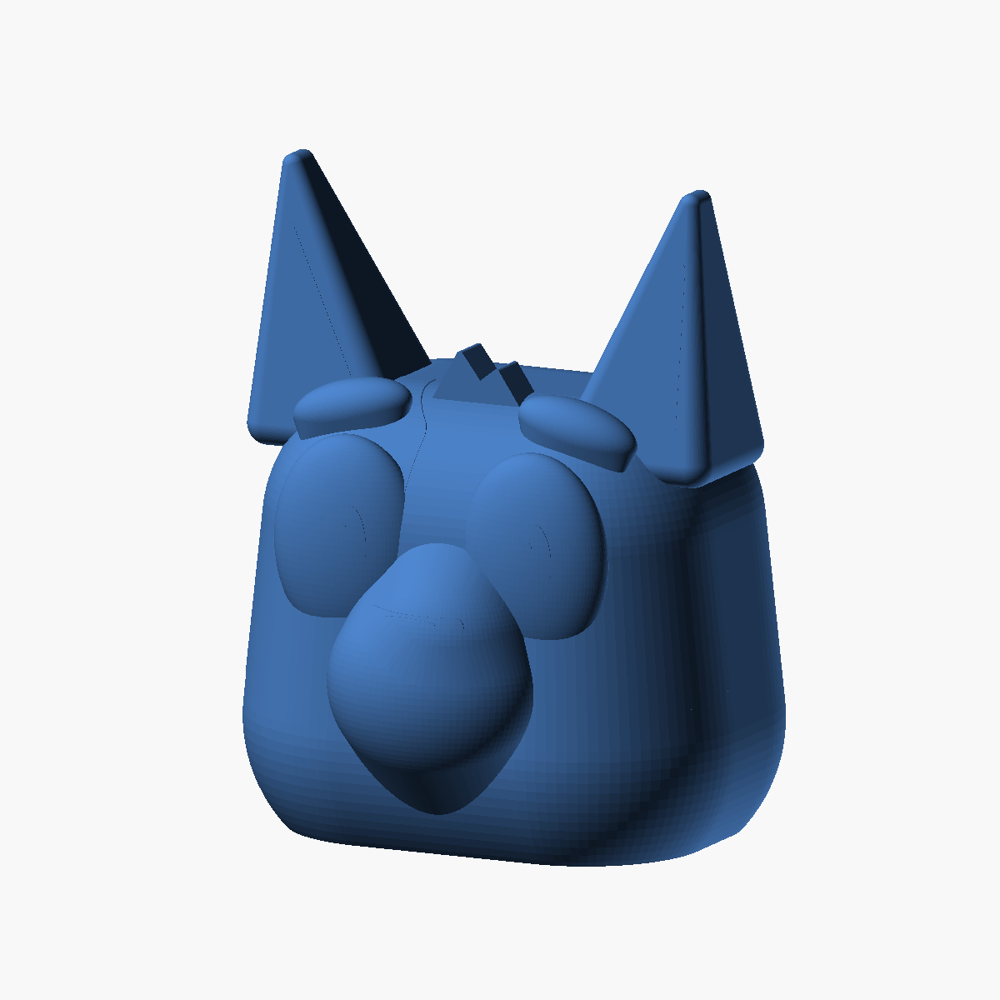
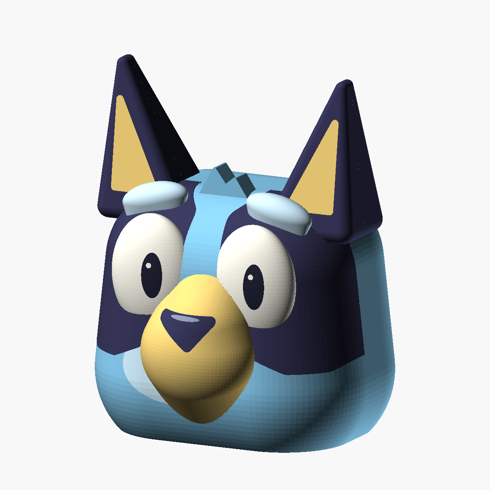

# Rounded Bluey no-smile head - single-piece V3





A **single continuous object** in the [three-variant project](../), based on the
[original rounded V1](../v1-rounded/), with **no smile or mouth line**.
There is no separate cap, joint, bonding lip, or assembly seam.
This is not the cylindrical/LEGO V2; both original variants remain unchanged.

The flat rounded-rectangle base rises into V1's soft cheeks, back, and crown.
The ears, inner-ear panels, eyes, pupils, highlights, eyebrows, forehead tuft,
rounded muzzle, and curved triangular nose are modeled details. The surface
is smooth, with no crochet texture and no hook or hanging hardware.

## Files and dimensions

| File | Purpose |
| --- | --- |
| [bluey_no_smile.scad](bluey_no_smile.scad) | Self-contained parametric source |
| [head.stl](head.stl) | Entire single-piece solid head, flat-base-down |
| [preview.png](preview.png) | Fully rendered geometry |
| [color-guide.png](color-guide.png) | Optional painting guide; the STL contains no colors |

The overall size is approximately **144 W x 130.1 D x 184.1 H mm**.
The flat standing footprint is approximately **121 x 89 mm**, with rounded
corners. The cheeks widen gradually above it. No fasteners or adhesive are
required, and there are no separate printed pieces to assemble.

## Printing and the single-piece tradeoff

Print with the **flat underside on the bed and ears pointing up**, as exported.
A brim is useful. For a lantern, translucent/natural or light-blue PLA is a
good starting point; opaque paint reduces light transmission.

**This single-piece version is not support-free when printed hollow.**
The gentler muzzle blends, shallow eyes, supported brow shapes, and curved
nose relief reduce difficult facial overhangs, but they do not support the
inside of the broad crown. The previous support-free workflow depended on
printing the crown separately; that split and its hardware have been removed.

The STL is a **solid master**: choose hollowing and wall thickness in your
slicer. For a hollow lantern:

- Start with a 0.4 mm nozzle, 0.16-0.20 mm layers, at least two 0.45 mm walls,
  and 0% infill. Adjust these for your printer and material.
- Keep sufficient top skins to close the crown and ears. Do **not** reuse
  the old two-piece body's zero-top-skin profile for this complete head.
- Leave an underside opening for the LED and support removal. Zero infill
  alone does not remove bottom skins; use open-base/hollowing controls or
  zero bottom layers and bottom shell thickness as appropriate.
- Enable removable internal supports beneath the crown and any unsupported
  upper facial or ear-root areas flagged by the slicer. Do not restrict
  support placement to the build plate if it leaves roof areas unsupported.
- Check the layer preview for supported inner walls and top skins, and verify
  that all support can be removed through the underside. Remove it before
  installing a light.

This is not vase mode. The previous two-piece support-free toolpath results
do not apply to this one-piece STL. A one-piece solid/decorative print can use
normal infill instead of a lantern cavity; still inspect external overhangs.
The model has not been physically printed.

## Lighting

Add your own LED retention and any future hanging attachment to suit the final
shell. There is no included light holder, base cover, or load-rated attachment.

**Cool-running, self-contained battery LED only.** No candles, flame, hot bulbs,
or mains lamp holders. Use an enclosed battery compartment, keep batteries
and small parts away from children, and check enclosure temperature before use.

## Adjustable parameters

Dimensions are in millimeters and grouped near the top of the source.

| Parameter | Default | Purpose |
| --- | --- | --- |
| `part` | `"assembled"` | `head`, `assembled`, `layout`, or `section` |
| `head_width`, `head_depth` | `144`, `112` | Original V1 rounded body dimensions |
| `cheek_radius`, `cheek_center_z` | `45`, `30` | Curved rise from the flat base |
| `crown_radius`, `crown_height` | `40`, `124` | Soft crown curvature |
| `forehead_width`, `forehead_depth` | `132`, `104` | Upper head proportions |
| `ear_tip_height` | `181` | Ear-tip sphere-center height |
| `eye_size`, `eye_y` | `[44, 20, 60]`, `-46` | Eye proportions and forward placement |
| `muzzle_y`, `muzzle_depth` | `-52`, `22` | Muzzle placement and half-depth |
| `muzzle_root_bottom`, `muzzle_root_top` | `4`, `100` | Lower and upper muzzle blends |
| `brow_root_z` | `107` | Height of the blended eyebrow roots |
| `detail_relief` | `0.2` | Small raised facial-marking steps |
| `$fn` | `96` | Curved-surface resolution |

`head`, `assembled`, and `layout` all show the same single object.
`section` removes the back half for inspection; it is not a printable part
and does not simulate slicer hollowing. Large proportion changes require
adjusting facial placement and reviewing the resulting print geometry.

## Regeneration

Run from this folder:

```bash
openscad --hardwarnings --render --export-format binstl -D 'part="head"' -o head.stl bluey_no_smile.scad
openscad --hardwarnings --render --autocenter --viewall --projection=ortho --camera=220,-460,200,0,0,88 --imgsize=1200,1200 --colorscheme=Tomorrow -D 'part="assembled"' -o preview.png bluey_no_smile.scad
openscad --hardwarnings --preview --projection=ortho --camera=260,-530,235,0,0,92 --imgsize=1200,1200 --colorscheme=Tomorrow -D 'part="assembled"' -o color-guide.png bluey_no_smile.scad
```

The visual references are the same as V1:
[official Bluey artwork](https://www.bluey.tv/characters/bluey/),
[Hello Stitches XO's amigurumi photographs](https://hellostitchesxo.com.au/bluey-amigurumi-free-pattern/),
and [Bellota Arte's amigurumi photographs](https://allamigurumi.com/crochet-bluey-amigurumi/).
Only the rounded form was referenced, not stitch texture. This is an unofficial
fan-made model.
