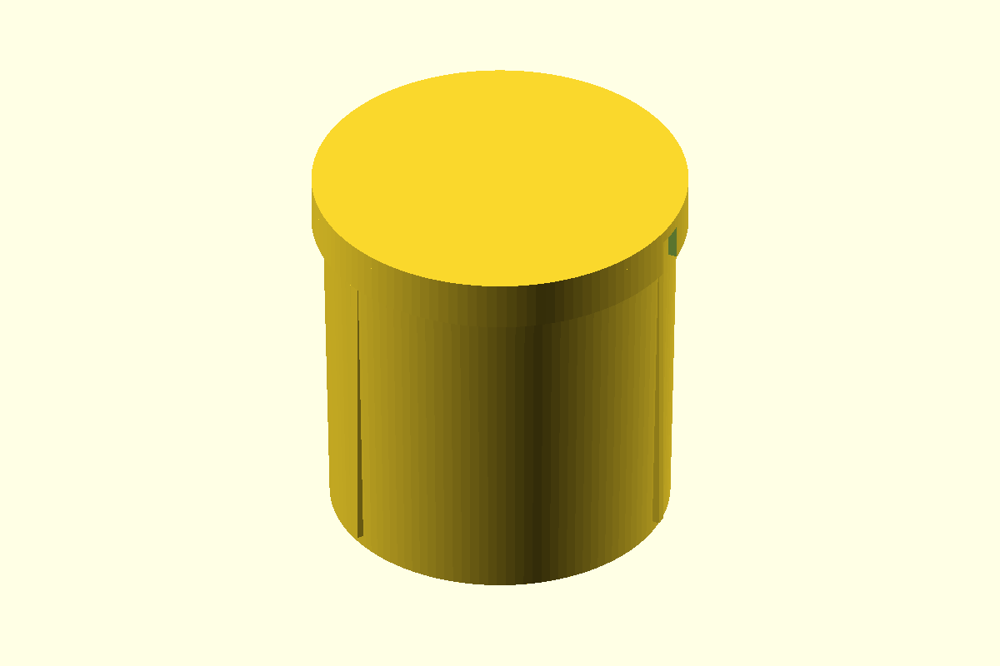

# Car Coin Holder

A two-piece, tapered coin container for a 70 mm car cup holder. The body has three compartments for mixed coins and a friction-fit lid.

## Files

| File | Description |
| --- | --- |
| [`car_coin_holder.scad`](car_coin_holder.scad) | Parametric OpenSCAD source |
| [`body.stl`](body.stl) | Coin holder body |
| [`lid.stl`](lid.stl) | Friction-fit lid |
| [`preview.png`](preview.png) | Assembled render |

## Printing

- Print the body open-side up.
- Print the lid with its flat top on the build plate.
- No supports are required.
- The default body is 68.4 mm at the top and 70 mm tall.

Change `cup_holder_diameter`, `fit_clearance`, or `lid_clearance` in the source to tune the fit.
