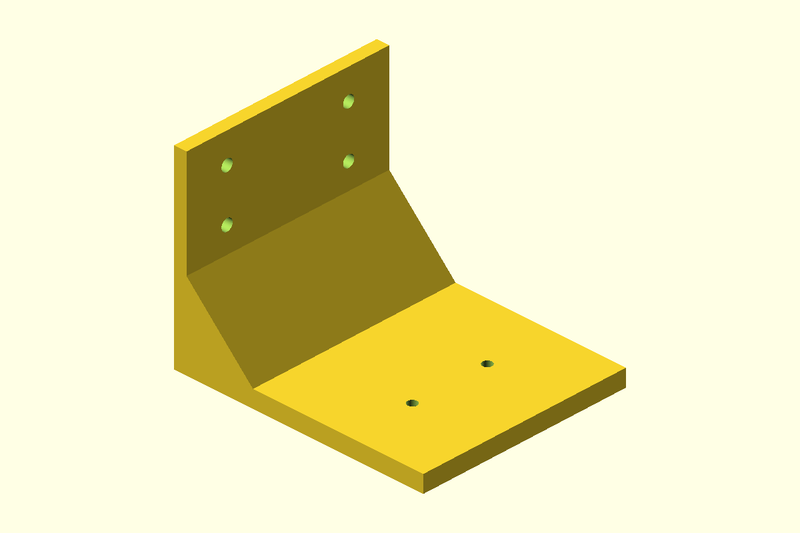

# Eufy C220 inverted wall bracket



One-piece reinforced L-bracket for hanging a eufy Indoor Cam C220 / T8W11
upside down from one wall near an inside corner. It does not attach to both
walls. The horizontal arm has two **37 mm center-to-center** mounting holes,
using the spacing supplied by the owner. The underside stays flat and clear;
the reinforcement sits above the arm.

## Files

- `eufy_c220_inverted_wall_bracket.scad`: editable parametric source.
- `bracket.stl`: single printable bracket, already oriented on its side.
- `preview.png`: bracket in installed orientation, not print orientation.

## Dimensions

| Feature | Default |
| --- | --- |
| Installed width x wall projection x height | 100 x 120 x 90 mm |
| Wall plate thickness | 6 mm |
| Horizontal arm thickness | 8 mm |
| Full-width upper reinforcement | 32 mm run x 32 mm rise |
| Camera mounting holes | Two 4.5 mm through-holes, 37 mm center-to-center |
| Camera hole line from wall-contact face | 84 mm |
| Wall mounting holes | Four 5.5 mm through-holes |
| Wall hole pattern | 60 mm across x 24 mm vertically |
| Wall hole heights above arm underside | 52 and 76 mm |
| Print bounding box | 90 x 120 x 100 mm |

The 37 mm spacing is user-provided, not a manufacturer drawing. Hole diameters,
arm size, and offset are design choices, not published eufy specifications.
This is a custom bracket, not a physically fit-tested or load-rated accessory.

## Hardware and assembly

Use the camera's supplied mounting plate. Eufy's
[T8W11 guide](https://service.eufy.com/article-description/Indoor-Cam-C220-User-Guide-T8W11)
shows the plate screwed to the supporting surface and the camera sliding onto
it, including for inverted ceiling mounting. This print does not reproduce that
slide-lock interface or require removing the camera's casing screws.

Provide two machine screws that fit the original plate and pass through the
4.5 mm printed holes, plus washers and locking nuts. M3 or M4 shafts can pass
through these holes, but the original plate determines which screw and head
actually fit. Select screw length for the 8 mm arm, plate thickness, washer, and
full locking-nut engagement. Use a head profile that seats in the original plate
without obstructing the camera's slide-on attachment. Do not drive the supplied
wall screws into these unthreaded clearance holes.

Provide four wall screws with shafts that clear the 5.5 mm holes, suitable heads
or washers, and anchors appropriate to the wall. The backplate is 6 mm thick;
fastener length must also provide the embedment required by the anchor or stud.
The model reserves room for hardware up to 12 mm outside diameter at all holes.

1. Disconnect the camera. Dry-fit its plate to the bracket underside and confirm
   the 37 mm hole alignment, screw-head clearance, and complete slide-lock travel.
2. Fasten the original plate under the arm, with locking nuts and washers above
   the arm. Orient its slide direction so the camera can engage and release
   without hitting either wall. Tighten snugly without crushing the print.
3. Position the bracket with the backplate rising above the arm. Leave clearance
   from the adjacent wall for the entire camera, pan/tilt movement, release
   movement, and USB-C connector. Mount securely using all four wall holes.
4. Route the cable freely beside the camera, slide it onto its original plate,
   and confirm it locks and cannot pull free before releasing your support.
   Reconnect power and select inverted mounting/image rotation in the app.

**Corner placement:** eufy recommends at least 200 mm from objects or walls to
avoid infrared reflections. This compact bracket does not guarantee that
clearance; nearby walls can degrade night vision. Keep it away from heat and
inspect the print and fasteners periodically. It is not intended for outdoor use.

## Printing

- Print `bracket.stl` in its exported orientation: the full L-shaped end face
  lies on the bed, with the bracket width extending 100 mm vertically.
- Suggested material: PETG; start with 0.20 mm layers, 5-6 perimeters, 6 top/bottom
  layers, and 40-50% infill. These are starting settings, not a load certification.
- No supports are intended: the L-section and reinforcement continue through
  the width. The small horizontal screw bores require short bridges; inspect
  their roofs in the slicer and clear any sagging material before assembly.
- A brim can help adhesion. Do not rotate onto the backplate or arm for printing:
  the side orientation keeps the L-shaped load path within each layer.

## Adjustable parameters

`camera_hole_spacing` is 37 mm. `camera_hole_diameter` changes screw clearance;
`camera_mount_offset` moves both camera holes toward or away from the wall.
`width`, `projection`, `wall_height`, `wall_thickness`, and `arm_thickness`
control the bracket envelope. `reinforcement_run` and `reinforcement_rise`
control the upper triangular reinforcement.

`wall_hole_diameter`, `wall_hole_spacing`, `wall_hole_lower`, and
`wall_hole_upper` control wall fixings. `camera_hardware_diameter` and
`wall_hardware_diameter` specify the washer/head/nut clearance envelopes used
by the assertions; they do not change the bore diameters. Assertions keep these
envelopes clear of the reinforcement, each other, and outer edges.

Use `part="bracket"` for the print orientation or `part="assembled"` for the
installed orientation. There is only one printed part.

Regenerate from this folder:

```sh
openscad --hardwarnings --render -o bracket.stl eufy_c220_inverted_wall_bracket.scad
openscad --hardwarnings --render --autocenter --viewall --projection=ortho --imgsize=1200,800 --camera=210,260,210,0,55,35 -D 'part="assembled"' -o preview.png eufy_c220_inverted_wall_bracket.scad
```
