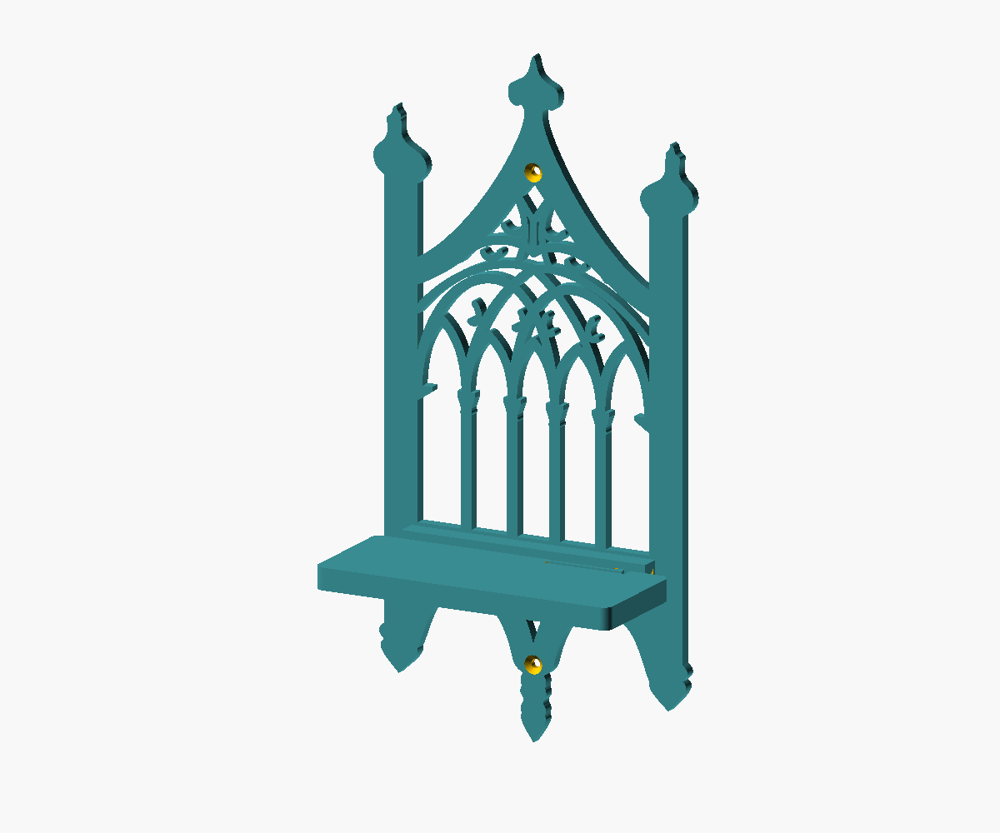

# Gothic shelf



A two-piece printable reconstruction of the shelf in [source.jpg](source.jpg):
the tall central finial, two side pinnacles, five lancet openings, interlaced
gothic tracery, collared mullions, paired lower arches, and bottom pendant are
modeled into one decorative backplate. The separate shelf slides into a hidden
horizontal dovetail rail and locks with an integral, releasable spring catch.
No third printed part, glue, pin, or joining screw is needed.

**The entire model is scaled to 95% of the previous design**, as requested.
The reference's 152 x 300 mm outline is now **144.4 x 285 mm**. The previous
5 mm backplate and 10 mm shelf panel are now **4.75 mm and 9.5 mm thick**.
The rail, latch, clearances, and mounting holes are uniformly scaled too.
Print the supplied STLs at 100% in the slicer; they already include this reduction.

The decorative curves are reconstructed from the photograph, not an original
manufacturing drawing. Depth, mounting details, and the concealed joint are
design assumptions; the photograph does not establish their dimensions.
The receiver adds local thickness beyond the 4.75 mm backplate; the shelf,
including its tongue, is 9.5 mm thick overall.

## Files

| File | Purpose |
| --- | --- |
| [gothic_shelf.scad](gothic_shelf.scad) | Parametric source, assembly, print layout, and clearance views |
| [backplate.stl](backplate.stl) | Print once: decorative backplate, receiver, stop, and latch pocket |
| [shelf.stl](shelf.stl) | Print once: shelf, sliding tongue, and integral spring catch |
| [preview.png](preview.png) | Assembled view |
| [source.jpg](source.jpg) | Supplied reference photograph and measurements |

## Dimensions

All dimensions are in millimeters and include the 0.95 output scale.

| Feature | Default |
| --- | --- |
| Overall assembly, width x height x wall projection | **144.4 x 285 x 66.5** |
| Decorative backplate thickness | 4.75 |
| Backplate print envelope, X x Y x Z | 144.4 x 285 x 13.3, including the rail |
| Shelf width | 133 |
| Shelf projection beyond the backplate's front face | 61.75, assumed |
| Flat shelf surface, width x depth | 133 x 52.915, with a small rear latch slot |
| Shelf slab thickness | 9.5 |
| Shelf print envelope, including the tongue | 133 x 59.85 x 9.5 |
| Shelf surface height above the bottom pendant tip | 79.8 |
| Receiver length / closed-end thickness | 110.2 / 3.8 |
| Captured tongue length | 102.03 |
| Sliding fit | 0.285 vertical and end clearance; 0.475 behind the tongue |
| Dovetail inclined-face normal clearance | Approximately 0.20 |
| Catch engagement / release movement | 1.14 / 1.425 |
| Spring length x in-plane thickness | 34.2 x 1.52 |
| Mounting holes | Two 3.99 through holes, 7.98 diameter 90-degree countersinks |
| Mounting centers | On the centerline, 32.3 and 236.55 above the bottom; 204.25 apart |

The shelf's rear tongue nests inside the receiver. The rail is integrated into
the solid sill and both side posts.
Its closed left end sets the insertion position; the catch prevents withdrawal
to the right. The dovetail shoulder captures the shelf against forward pull
and upward movement after the running clearance is taken up.

## Printing

Print **one backplate and one shelf**, keeping the STL orientations as supplied.

| Part | Orientation | Supports |
| --- | --- | --- |
| Backplate | Flat decorative outline on the bed, wall-facing side down, receiver up | None |
| Shelf | Broad flat underside on the bed, tongue and catch facing up | None |

PETG is recommended, particularly for the flexible catch. Use a 0.4 mm nozzle,
0.2 mm layers, at least 5 perimeters, 6 top/bottom layers, and 35-45% infill.
The rail and hook have 45-degree printable slopes. The catch bends within the
XY layer plane rather than pulling layers apart. Do not rotate the shelf onto
its edge or fill the spring slot with support material.

The backplate requires **at least 144.4 x 285 mm of usable bed area**; allow extra
room for a brim or skirt, preferably a 160 x 300 mm area. It still does not fit a
standard 220 x 220 mm bed. Do not apply another 95% reduction in the slicer.
The shelf needs a 133 x 59.85 mm area. The optional combined `layout` occupies
291.65 x 285 mm before a brim; the two STLs can be printed in separate jobs.

Remove strings and any elephant foot from the rail, tongue, and latch slot.
Keep the spring free and avoid levering it vertically. If the fit is too tight,
adjust `fit_clearance` in the source and regenerate **both** pieces instead
of scaling either STL independently.

## Hardware and assembly

Use two nominal 3.5 mm countersunk screws with heads no larger than 7.98 mm,
plus anchors appropriate to the wall. Screw length and anchor choice depend
on the wall construction. The scaled 3.99 mm holes no longer provide clearance
for nominal 4 mm screws. Fasteners are not included in the printable files.

1. With the shelf removed, mount the backplate upright and flat against the
   wall using the two countersunk holes. Seat the heads flush without crushing
   the plastic. Leave approximately 115 mm of clear space to its right for
   inserting and removing the shelf.
2. Facing the shelf from the front, offer its rear tongue to the **open right
   end** of the receiver. Keep the shelf horizontal and slide it **right to
   left**. Do not push the tongue straight toward the wall.
3. Push gently until the left stop is reached and the spring catch clicks into
   its pocket. The ramp cams the catch toward the front edge during insertion;
   if necessary, hold the free end forward while sliding. Release it fully
   into the pocket and confirm it resists a gentle slide back to the right.
4. To remove, unload the shelf. Move the spring's free end near the rear-right
   corner about 1.43 mm **away from the wall, toward the shelf front**, using the
   accessible slot. Hold it there while sliding the shelf to the right.

This is a decorative, light-object shelf, not a load-rated structural bracket.
Physical fit, latch cycling, wall fixings, and load capacity have not been
established by a physical prototype. Keep heavy, valuable, or hazardous objects
off it; do not use an open flame on or near the plastic.

## Adjustable parameters and views

Important source parameters are grouped near the top. All source lengths remain
in the previous design's nominal millimeters; `output_scale = 0.95` multiplies
every final length, including clearances, inspection offsets, and layout spacing.
Use `output_scale = 1` to recover the previous size.

| Parameter | Meaning |
| --- | --- |
| `output_scale` | Uniform final scale for all parts and views; 0.95 |
| `width`, `height` | Nominal reference outline, 152 and 300; exports at 144.4 and 285 |
| `back_thickness` | Nominal 5 mm panel thickness; exports at 4.75 mm |
| `shelf_width`, `shelf_depth`, `shelf_thickness` | Nominal shelf dimensions; 10 mm thickness exports at 9.5 mm |
| `shelf_bottom` | Height of the shelf underside |
| `fit_clearance` | Nominal running clearance; 0.3 exports at 0.285, 0.4-0.5 gives a looser fit |
| `rail_wall`, `rail_length`, `rail_stop` | Receiver material, engagement length, and closed end |
| `rail_tongue_height` | Uses `min(shelf_thickness + 4, 10)` to keep the hook free and the receiver below the window openings |
| `latch_length`, `latch_thickness`, `latch_engagement` | Spring geometry and retention |
| `mount_hole_diameter`, `mount_head_diameter` | Screw clearance and countersink size |

The outline dimensions and mechanical parameters are not independent: assertions
require the receiver to remain on the sill, its ends to overlap the posts, and
material to remain around the latch. `rail_depth` is fixed at 9 for this joint
section. Large changes to the reference dimensions require coordinated joint
changes, not just disabling the assertions.

`part` selects `backplate`, `shelf`, `assembled`, or `layout`. The two individual
part values are already in printing orientation. In `assembled`,
`insertion_offset` moves the shelf right and `latch_deflection` shows the spring
bending forward; use nominal values 116 and 1.5 respectively to see the insertion
arrangement (110.2 and 1.425 after scaling).

`collision_check` intersects the assembled parts at the chosen insertion offset
and latch deflection. `insertion_check` checks the seated position, contact with
the left stop, and insertion at 2 nominal mm intervals (1.9 actual mm) with the
latch released.
**An empty result is expected** for these clearance checks; OpenSCAD reports
"Current top level object is empty" and exits with status 1 when exporting the
empty intersection to STL. An unflexed `collision_check` at a nominal offset of 0.8
intentionally produces contact at the latch shoulder, demonstrating retention;
an offset of -0.8 demonstrates the closed stop. These offsets become +/-0.76 mm
in the scaled output.

## Regenerating

Run in this folder with OpenSCAD:

```sh
openscad --render -D 'part="backplate"' -o backplate.stl gothic_shelf.scad
openscad --render -D 'part="shelf"' -o shelf.stl gothic_shelf.scad
openscad --render --colorscheme=Tomorrow --autocenter --viewall \
  --projection=ortho --imgsize=1200,1000 \
  --camera=330,-650,350,0,-25,150 \
  -D 'part="assembled"' -o preview.png gothic_shelf.scad
openscad -D 'part="layout"' gothic_shelf.scad
```

If the GUI reports a GLEW error under Wayland, launch it through X11 with
`QT_QPA_PLATFORM=xcb LIBGL_ALWAYS_SOFTWARE=1 openscad -D 'part="layout"' gothic_shelf.scad`.
