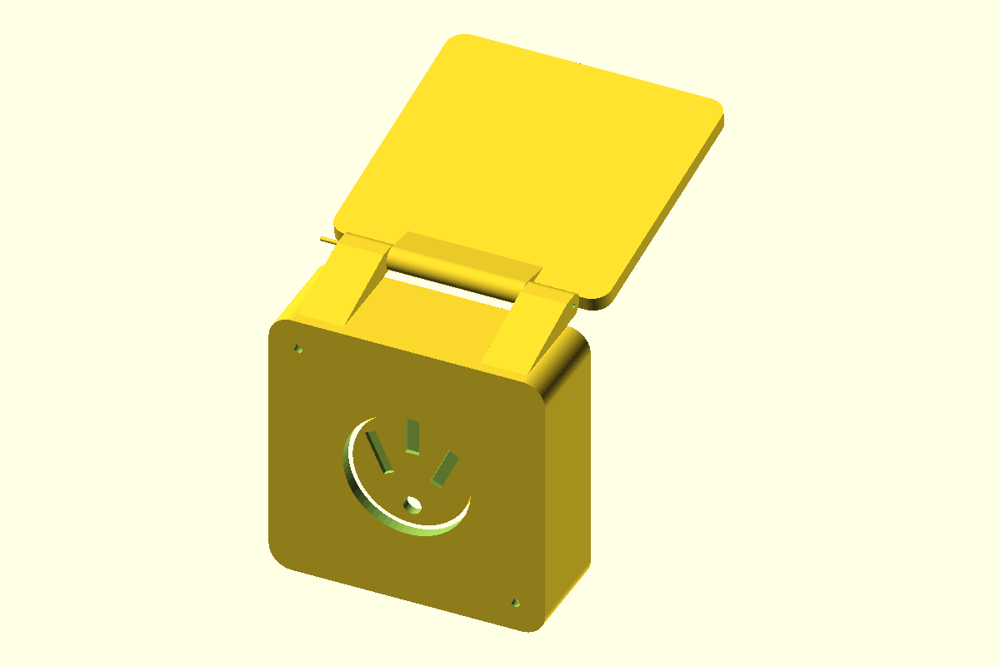

# NEMA 14-50R Outdoor Box Lid

A weatherproof **lid only** for a NEMA 14-50R receptacle that is already
installed in a square EMT double box mounted on an outdoor wall. It does
**not** replace or include the box — it bolts directly onto the box's two
existing diagonal cover screws (top-left and bottom-right on this box) using
the box's own tapped holes. A shallow ASA shroud clears the receptacle face
and carries a top hinge; a flap swings up on a pin made from raw 1.75 mm
filament so a cord can exit at the bottom while a car (or other 50 A load) is
plugged in, and swings back down to compress a TPU gasket over the opening
when the receptacle isn't in use.

## Files

| File | Material | Description |
| --- | --- | --- |
| `nema_14_50r_box_lid.scad` | — | Parametric OpenSCAD source, single source of truth |
| `lid.stl` | ASA | Shroud + back plate + 2 stationary hinge barrels, bolts to the box |
| `flap.stl` | ASA | Hinged flap leaf + its own hinge barrel, pinned to the lid |
| `lid_gasket.stl` | TPU | Flat gasket between the lid's back plate and the box face |
| `flap_seal.stl` | TPU | Ring gasket bonded to the back of the flap, seals against the lid's front curb when closed |
| `preview.png` | — | Rendered assembled preview (flap open) |

## Important: verify your own hardware first

The defaults are set from this box's actual measurements:

- **3.65 in (92.7 mm) square** internal box opening (measured, not a
  nominal industry size).
- Cover screws spaced **135 mm** apart on the diagonal, positioned
  **top-left and bottom-right** (measured).
- Screw shank diameter **3 mm** (measured), with a 3.6 mm clearance hole
  and a 6.5 mm head-clearance counterbore.
- A NEMA 14-50R flush receptacle with a face/bezel around **66 mm** in
  diameter clearance (not yet re-measured against this specific box —
  double check before printing).

If your box, screws, or receptacle differ from these measurements, adjust
the parameters at the top of the `.scad` file (`box_face_width/height`,
`box_mount_diagonal`, `box_mount_screw_clearance`,
`box_mount_head_diameter`, `receptacle_clearance_diameter`) before
printing. The mounting-hole sign pattern (`[[-1, 1], [1, -1]]` in
`lid_cutouts()` and `lid_gasket()`) encodes top-left/bottom-right; flip it
to `[[1, 1], [-1, -1]]` for top-right/bottom-left instead.

## Dimensions (as designed)

- Lid overall: 118.7 x 118.7 mm, 42 mm forward projection from the box face
  (room for the hinge, the closed flap, and a cord bend at the bottom).
- Wall thickness: 3.2 mm. Back plate (against the box face): 5 mm.
- Flap: 126.7 x 106.7 mm leaf, 4 mm thick, overlapping the lid on the sides
  and bottom by 4 mm each to shed water; kept clear of the lid's top
  edge/hinge zone.
- Hinge: sized for a raw **1.75 mm** 3D-printer filament strand as the pin,
  running through printed knuckles (two stationary barrels on the lid, one
  center barrel on the flap) with 0.25 mm bore clearance and 0.6 mm swing
  clearance between the flap barrel and the lid barrels.
- Gaskets: 2 mm thick TPU, printed flat, bonded to their mating ASA part
  with adhesive (no press-fit channel).

## Hardware

- 2x screws already in your box (top-left/bottom-right) — reused, not
  supplied by this design.
- 1x length of 1.75 mm filament (any material) cut to size, used as the
  hinge pin.
- Optional: a small dab of super glue or a heat-formed head on each end of
  the filament pin to keep it from sliding out.

## Print orientation and supports

- **`lid`**: print with the back plate face-down on the bed (as oriented by
  the `lid_for_printing()` module used by the `lid` part). The stationary
  hinge anchors are tied down to the back plate with a built-in solid
  support rib (`hinge_support_rib()`), so they no longer cantilever over an
  open gap. The shroud walls, hinge barrels, and ribs rise upward with no
  large overhangs; slicer auto-supports can be left off (set support
  threshold to ~50-55° / "support on build plate only" if your slicer
  still flags the small self-bridging notches in the front curb ring where
  it's relieved for hinge clearance — those are a few millimeters wide and
  print fine unsupported).
- **`flap`**: print flat, back face down (as oriented by
  `flap_for_printing()`); no supports needed.
- **`lid_gasket` / `flap_seal`** (TPU): print flat, no supports. Use a slower
  print speed appropriate for flexible filament.
- Nozzle: designed for **0.4 mm**. All wall/rib features are multiples of
  the nozzle width for solid, gap-free perimeters.

## Assembly

1. Print `lid` and `flap` in ASA, and `lid_gasket` + `flap_seal` in TPU.
2. Slide the 1.75 mm filament pin through the lid's two outer hinge barrels
   and the flap's center hinge barrel to join them. Trim flush and, if
   desired, lightly melt/flare each end so the pin can't slide out.
3. Bond `lid_gasket` to the back of the `lid` (super glue or solvent weld),
   aligned with the receptacle opening and the two mounting holes.
4. Bolt the `lid` to the box using the box's existing two diagonal cover
   screws, compressing the gasket.
5. Bond `flap_seal` to the back of the `flap` leaf (super glue or solvent
   weld); when the flap is closed it compresses against the raised curb
   on the lid's front rim, sealing the opening against rain.

## Design notes / limitations

- This is a lid-only accessory for an **existing** box — it assumes the box
  itself is already properly mounted, grounded, and code-compliant for
  outdoor use. This design does not add any weatherproofing to the box
  itself, only to the opening in front of the receptacle.
- The top ~16 mm strip of the opening nearest the hinge is not covered by
  the compressible TPU seal (only the ASA-to-ASA hinge fit shields that
  area) — a common trade-off for simple single-hinge-pin outdoor covers.
  For extra protection in heavy rain, mount the box with the hinge at the
  top facing away from prevailing wind-driven rain if possible.
- All four parts were verified to render as single, watertight, fully
  connected solids, and the hinge sweep (`hinge_clearance_check`, 0-120°)
  was verified to be fully collision-free between the flap and the lid at
  every tested angle.
- **This is not a substitute for a UL/NEMA-listed "in-use" weatherproof
  cover where required by local code.** Verify your local electrical code
  requirements for outdoor 240 V/50 A receptacles before relying on this
  part outdoors.
