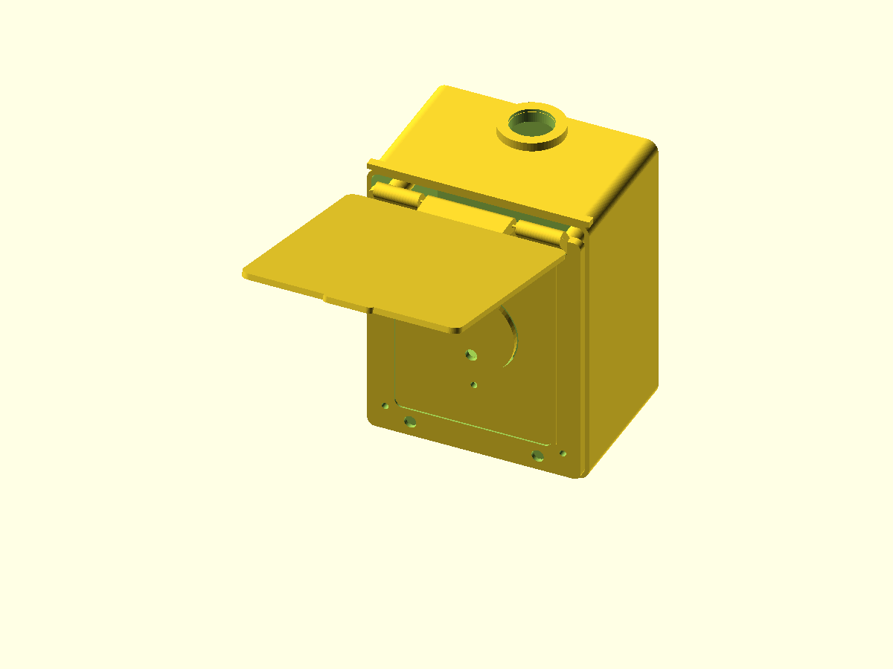

# NEMA 14-50R Outdoor Enclosure

A parametric wall-mounted enclosure for a common panel-mount NEMA 14-50R receptacle. The ASA shell has an open front with a gasketed removable faceplate, a top 3/4-inch trade-size conduit entry, two reinforced internal wall-mounting holes, and a rain flap on separated circular hinge barrels. Separate TPU parts seal the faceplate, flap, conduit hub, and wall fasteners.

The flap protects the receptacle only while it is unplugged. It is not a listed extra-duty in-use cover and cannot close over an EV charging plug.

> **Electrical safety:** This 3D-printed enclosure is not UL/ETL listed, NEMA rated, fire rated, or guaranteed watertight. Layer lines, UV aging, impact, heat, and installation quality can compromise it. For a permanent 240 V / 50 A EV charging circuit, use a listed receptacle, listed wet-location box or enclosure, listed extra-duty in-use cover where required, listed watertight conduit hub, correct conductor size and torque, and all GFCI/grounding provisions required by local code. Have the installation reviewed and performed by a licensed electrician. Use this design only where the authority having jurisdiction permits it, or as a secondary rain shield around listed electrical equipment.

## Files

| File | Description | Suggested material |
| --- | --- | --- |
| [`nema_14_50r_outdoor_enclosure.scad`](nema_14_50r_outdoor_enclosure.scad) | Parametric OpenSCAD source | - |
| [`body.stl`](body.stl) | Main enclosure with rear-aligned top conduit boss and internal wall mounts | ASA |
| [`faceplate.stl`](faceplate.stl) | Removable receptacle mounting plate | ASA |
| [`flap.stl`](flap.stl) | Standard rain flap for the separate seal | ASA |
| [`flap-integrated-asa.stl`](flap-integrated-asa.stl) | Optional multi-material flap with TPU anchor recesses | ASA |
| [`flap-integrated-tpu.stl`](flap-integrated-tpu.stl) | Aligned TPU seal and eight molded-through anchors | TPU |
| [`flap-with-integrated-seal.stl`](flap-with-integrated-seal.stl) | Combined geometry for preview or single-material printing | ASA or TPU |
| [`faceplate-gasket.stl`](faceplate-gasket.stl) | Seal between the body and faceplate | TPU |
| [`flap-seal.stl`](flap-seal.stl) | Seal compressed by the closed flap | TPU |
| [`conduit-gasket.stl`](conduit-gasket.stl) | Secondary washer beneath the conduit hub | TPU |
| [`wall-mount-washer.stl`](wall-mount-washer.stl) | Sealing washer for one internal wall screw; print two | TPU |
| [`preview.png`](preview.png) | Assembled render with the flap open | - |

## Main dimensions

- Enclosure body: 150 x 190 x 100 mm, excluding the visor and conduit boss
- Wall and rear thickness: 3.2 mm and 4.2 mm
- Faceplate: 144 x 176 x 4 mm
- Receptacle body cutout: 60 mm diameter
- Receptacle mounting-hole spacing: 83.3 mm center-to-center
- Top conduit opening: 28.8 mm diameter for a typical 3/4-inch trade-size hub
- Conduit center: 22 mm from the rear, making the modeled 44 mm hub/gasket footprint tangent to the mounting-wall plane
- Internal wall mounting holes: 6.5 mm diameter with 13 mm counterbores
- Wall mounting-hole spacing: 100 mm vertically on the enclosure centerline

Receptacle and conduit fitting dimensions vary by manufacturer. Measure the actual listed components before printing.

## Hardware

- One listed NEMA 14-50R receptacle
- One listed 3/4-inch wet-location conduit hub with its supplied sealing washer and locknut
- Four M4 heat-set inserts, approximately 5.3 mm installation diameter and 7 mm long
- Four M4 stainless faceplate screws, normally 16-20 mm long
- Two receptacle screws with washers and locknuts sized for the selected receptacle
- One straight piece of 1.75 mm ASA filament, approximately 135 mm long, for the flap hinge
- Four optional 8 x 3 mm corrosion-resistant disc magnets, installed as two attracting pairs
- Two corrosion-resistant wall screws and anchors appropriate for the wall
- Two printed TPU wall-mount washers
- Exterior-rated neutral-cure silicone or another electrical-enclosure sealant approved for the installed materials

Do not substitute printed hardware for the receptacle fasteners, conduit locknut, grounding hardware, or wall fasteners.

## Printing

- Print the body with its rear wall on the build plate and the front opening facing upward.
- Use local support inside the round conduit opening and beneath any visor edge your slicer cannot bridge cleanly.
- Print the faceplate with its rear face on the build plate. Each outer hinge knuckle is a continuous teardrop-shaped solid blending the 10 mm barrel into a 10 mm-deep, full-width anchor. Only the 2 mm horizontal bore may need cleanup; verify it with scrap 1.75 mm filament.
- Print the flap with its exterior face on the build plate. Its center knuckle uses the same continuous teardrop profile, mirrored into the flap leaf.
- Print all TPU seals flat.
- For an attached two-material seal, import `flap-integrated-asa.stl` and `flap-integrated-tpu.stl` together as parts of one object without moving either file, then assign ASA and TPU respectively. The TPU fills eight through-holes and recessed heads, so retention does not depend only on ASA-to-TPU adhesion.
- STL does not store material assignments. `flap-with-integrated-seal.stl` is included for geometry inspection or single-material printing; use the two aligned component STLs for a real ASA/TPU print.
- ASA-to-TPU bonding varies by filament brand, temperature, and contamination. Test the pair first; the modeled anchors provide mechanical retention but do not guarantee a watertight material interface.
- ASA is recommended for the rigid parts because of its UV and temperature resistance. Use an enclosure and the filament manufacturer's ventilation precautions.
- Use at least 5 perimeters, 6 top and bottom layers, and 35-50% infill. Use 100% infill or a dense modifier across all three hinge barrels and their gussets.
- TPU 95A is a practical starting point for the seals. Print them solid with 3-4 perimeters.

## Assembly

1. Test-fit the receptacle in the faceplate. Adjust the cutout and mounting spacing in the source if required.
2. With the faceplate removed, mount the body through the two internal rear-wall bosses. Place one TPU washer under each screw head and apply an approved sealant around each rear-wall penetration.
3. Install the four heat-set inserts in the faceplate bosses without overheating or distorting the front sealing surface.
4. Mount the receptacle to the faceplate with metal screws, washers, and locknuts.
5. For the standard flap, bond or lightly retain `flap-seal.stl` on its inside face. For the multi-material flap, inspect all eight TPU anchor heads for complete fill and gently pull-test the seal. Install the optional magnet pairs and confirm polarity before adhesive cures.
6. Place the flap's circular center barrel between the two circular faceplate barrels, then push straight 1.75 mm ASA filament through all three. The 4 mm gaps between barrels and radial clearance around the leaves allow the flap to rotate. Trim the filament with about 1 mm protruding at each end and carefully mushroom the ends with a temperature-controlled tool so the pin cannot slide out.
7. Place the TPU faceplate gasket against the body and tighten the four M4 screws evenly. Do not crush the gasket or strip the inserts.
8. Install the listed conduit hub through the top opening using its supplied seal. The printed TPU conduit gasket is only a secondary washer.
9. After the electrician completes the wiring, inspect all seams and perform an appropriate water-ingress check with the circuit de-energized.

## Important parameters

- `box_width`, `box_height`, and `box_depth`: overall enclosure size
- `wall_thickness` and `back_thickness`: ASA shell thickness
- `receptacle_cutout_diameter`: round body clearance
- `receptacle_mount_spacing`: vertical mounting-hole spacing
- `conduit_hole_diameter`: measured hub knockout diameter
- `wall_mount_z`: vertical locations of the two internal mounting holes
- `wall_screw_diameter` and `wall_screw_head_diameter`: wall fastener fit
- `wall_mount_boss_diameter` and `wall_mount_boss_depth`: rear-wall reinforcement
- `insert_pocket_diameter` and `insert_pocket_depth`: heat-set insert fit
- `hinge_pin_diameter` and `hinge_clearance`: 1.75 mm filament hinge fit
- `hinge_outer_diameter`: barrel strength; 10 mm provides about 4 mm of radial material around the bore
- `hinge_anchor_height`: reinforced attachment length down each printed leaf
- `integrated_anchor_hole_diameter` and `integrated_anchor_head_diameter`: mechanical retention for the optional co-printed TPU seal
- `magnet_diameter` and `magnet_depth`: flap closure magnet fit
- `faceplate_gasket_thickness` and `flap_seal_thickness`: TPU compression
- `preview_flap_angle`: assembled preview opening angle

Use `part="assembled"` for the preview. Printable values are listed beside the `part` selector near the top of the source. `hinge_clearance_check` is a diagnostic value used to test the moving flap at `hinge_test_angle`.

`part="layout"` displays the body, faceplate, standard flap, integrated ASA flap, aligned integrated TPU seal, separate gaskets, conduit gasket, and wall-mount washer.
