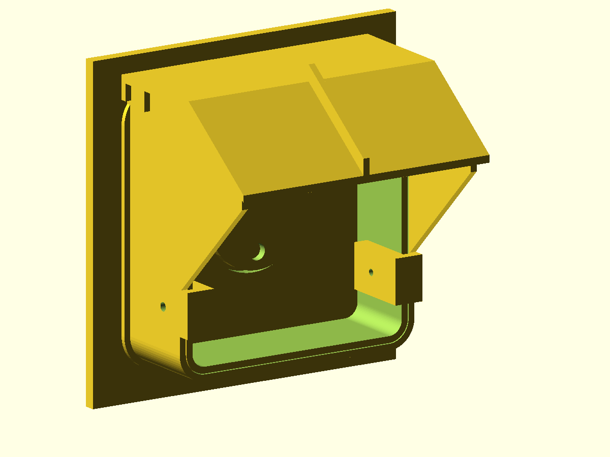

# NEMA 14-50R Rain Hat



A removable, screw-on **rain hat** that retrofits onto the already-installed
[NEMA 14-50R box lid](../nema-14-50r-box-lid/). It is a one-piece ASA
accessory that clamps to the outside of the lid's shroud, pushes flush
against the wall, and arches a canopy over the receptacle, throwing rain and
roof drips clear of the opening while a 50 A cord stays plugged in.

## Why this exists

The box lid it mounts to is already printed, gasketed, and bolted to the wall
box through the box's own cover screws. It cannot be taken off or reworked.
This design is therefore **strictly additive**: it uses only surfaces the
installed lid already has — the outside faces of its 118.7 mm shroud, its
front rim, and the two stationary hinge barrels — and it cuts, drills, or
reshapes nothing.

The **only** thing removed from the existing assembly is the hinged flap:

- pull the 1.75 mm filament hinge pin,
- lift off `flap.stl` and its bonded TPU `flap_seal`,
- leave the lid, its gasket, its mounting screws, and both stationary hinge
  barrels exactly where they are.

The hat then slides on in the flap's place. Every dimension in the
"Installed lid interface" block of the `.scad` is copied from
`../nema-14-50r-box-lid/nema_14_50r_box_lid.scad` and **must not be changed**
unless that lid is reprinted.

## Files

| File | Material | Description |
| --- | --- | --- |
| `nema_14_50r_rain_hat.scad` | — | Parametric OpenSCAD source, single source of truth |
| `rain_hat.stl` | ASA | The complete hat: collar, sealing flange, both clamp jaws, canopy, wings, and spine rib, as one printed piece |
| `preview.png` | — | Rendered preview of the hat fitted to the installed lid, seated against the wall |

The source `use`s the lid model directly, so the fit, slide-on, and plug
clearance checks run against the real installed geometry rather than a
copy of its outline.

## How it attaches

1. **Slip collar.** A U-shaped sleeve (left, right, and bottom walls, no top
   wall) slides straight back over the outside of the lid's 118.7 mm square
   shroud and runs 44 mm from the wall to the lid's front rim. The forward
   40 mm of it is a 0.4 mm slip fit per side, which locates the hat in every
   direction except fore/aft; only the rear 4 mm is relieved to clear the
   lid's gasket.
2. **Depth stop is the wall.** The hat is pushed back until its rear flange
   is flush against the wall. The clamp jaws deliberately stop 2 mm short of
   the lid's front rim so the rim can never bottom out first.
3. **Pinch clamps.** Each jaw is a C: the collar wall is the outer leg, and
   a 7 mm finger slides into the shroud opening alongside the side wall as
   the inner leg. One M4 screw per side passes through a 4.4 mm clearance
   hole in the collar and threads into a 3.4 mm self-tapping pilot in the
   finger, pinching the lid's 3.2 mm side wall between them.

Back the two screws out a few turns and the hat lifts straight off. Nothing
else touches the lid, and no load is placed on the hinge barrels.

## Keeping water out

The lid's two hinge-barrel support ramps rise straight out of its top face,
so the hat cannot simply wall off the space above the lid — that span has to
stay clear for the canopy to sweep over the barrels during installation
(see [below](#clearing-the-lids-hinge-supports)). Instead that space is
enclosed on every side that a one-piece slide-on part can reach:

| Face | What closes it |
| --- | --- |
| Top | The canopy runs all the way back to the wall, roofing over the lid's whole top face and both ramps |
| Left / right | The side wings run back to the wall in the same planes as the collar walls |
| Back | The wall itself, against a flat sealing flange, plus a lip immediately inboard of it |
| Middle | A second notched lip 14 mm in, as a splash baffle |
| Front | Left open under the 58 mm canopy overhang, for the plug and for drainage |

The two lips are notched where the ramps sweep through, but those notches
now sit **inboard** of an unbroken outer sealing perimeter, so they are no
longer a path to the outside.

Nothing is sealed shut on purpose. A ~1.8 mm slot is left between the lid's
top face and the lip at the wall so any water that does get in can drain
forward and out under the canopy rather than pooling against the wall.

## Pushing it flush and sealing it

The lid is bolted down over a 2 mm TPU gasket, so the wall/box face it is
clamped against sits 2 mm behind the lid's own back face. The hat is built
to reach that plane:

- The rear 4 mm of the bore is opened up by 1.4 mm per side so the hat
  rides over the compressed gasket instead of jamming on it. The
  `fit_check` and `slide_on_check` diagnostics include a deliberately
  oversized gasket envelope (0.8 mm of squeeze-out) so this is verified,
  not assumed.
- The rear face finishes in a **4.8 mm wide flat sealing land** that rings
  the lid: a flange around the sides and bottom, the wings' rear edges up
  both sides, and the canopy's rear edge across the top. Its outside is
  flush with the canopy's drip edge, 131.9 mm across, and it is a single
  unbroken loop (verified — see [Validation](#validation)).
- Seal it either way round:
  - **Foam tape** — stick 3 mm closed-cell EPDM or neoprene weatherstrip to
    the land before fitting, and let the two M4 screws hold it compressed.
  - **Sealant** — fit the hat first, then run a bead of exterior-grade
    silicone or polyurethane in the outside corner where the hat meets the
    wall. Seal the **top and both sides only** and leave the bottom open,
    so the hat can still drain.

If your box stands proud of the wall, or your siding is uneven and the hat
will not seat, raise `wall_setback` (in mm) and re-render — everything moves
forward together. The hat still clamps correctly anywhere in its travel,
because the M4 screws pinch the lid's side walls rather than relying on the
rim as a stop.

## Dimensions (as designed)

- Hat overall: **131.9 mm wide x 102 mm deep x 147 mm tall** (the printed
  bounding box; 131.9 x 147 mm footprint, 102 mm tall on the bed).
- Fitted to the lid it spans from the wall face (2 mm behind the lid's back
  face) to **58 mm past the lid's front rim**, and stands **21.7 mm above
  the lid's top face** at the spine rib.
- Collar: 44 mm deep, 3.2 mm walls, 125.9 mm outside square. 0.4 mm
  clearance per side over the grip section, opening to 1.8 mm over the rear
  4 mm to clear the gasket.
- Sealing flange: 2.4 mm deep, 3 mm proud of the collar, 131.9 mm outside
  square, leaving a 4.8 mm wide land against the wall.
- Canopy: 3.6 mm thick, 131.9 mm wide, giving a 3 mm drip edge proud of the
  collar on each side. Underside held flat at Z = 128.8 mm from the wall
  back to the shoulder at Y = 54 mm, then sloping down and forward to
  Z = 95 mm at the front tip.
- Side wings: 3.2 mm plates in the same planes as the collar's side walls,
  running from the wall out to (Y = 94, Z = 90) to close the sides against
  wind-driven rain.
- Spine rib: 3.2 x 8 mm along the centreline of the canopy, stiffening the
  overhang.
- Lips: one at the wall (underside Z = 120.5 mm) and one 14 mm in (underside
  Z = 119.1 mm), both notched with 1.5 mm relief around the ramps.
- Clamp jaws: 7 mm fingers at 0.5 mm clearance inside the shroud, 22 mm
  tall starting 19 mm up from the lid's bottom edge, beginning 14 mm out
  from the box face so they clear the lid's 5 mm back plate; screw axis at
  Y = 28 mm and Z = 30 mm.

### Clearing the lid's hinge supports

The installed lid is not flat on top. Its `stationary_hinge_barrel()`
supports rise out of the top face as two sloped ramps at X = 10-30 mm and
X = 88.7-108.7 mm, climbing from Z = 118.7 mm at Y = 4.8 mm to the barrel
top at Z = 127.3 mm.

Because the hat is pushed **straight back** onto the lid, the entire rear
span of the canopy sweeps over the *full* barrel height during installation,
not just over the ramp where it finally sits. The canopy underside is
therefore held **flat** at Z = 128.8 mm (1.5 mm above the barrel tops) all
the way from the wall to the shoulder, and only falls away in front of the
barrels. For the same reason the two lips *must* be notched where the ramps
pass: any feature that ends up at Y <= 52 mm has swept over the barrel tops
to get there, so it cannot dip below Z = 128.8 mm. That is why the space
above the lid is sheltered and drained rather than sealed shut. Do not lower
the canopy underside or move `roof_shoulder_y` back — the hat will no longer
go on.

## Hardware

- **2 x M4 x 16 mm stainless steel screws.** A knurled thumb screw or a hex
  socket cap is recommended: the screw axis runs sideways (parallel to the
  wall), 28 mm out from the box face, so a stubby driver or bare fingers are
  easier than a long screwdriver. M4 x 14 to M4 x 20 mm all work; the screw
  needs 14.3 mm of reach to bottom out in the finger and there is nothing
  behind it for another 19 mm.
- No nuts, inserts, or adhesive. The M4 threads cut directly into the ASA
  finger.
- **Sealing (pick one):** ~3 mm closed-cell EPDM/neoprene weatherstrip tape
  for the rear land, **or** a tube of exterior-grade silicone or
  polyurethane sealant for an outside fillet.

## Print orientation and supports

- Print **`rain_hat.stl` as supplied by the `hat` part**: it is already
  rotated onto its back, standing on the rear sealing flange, canopy
  pointing up. 131.9 x 147 mm footprint, 102 mm tall.
- **No supports needed.** In this orientation the collar walls, wings, lips,
  jaws, and the flat rear span of the canopy are all vertical walls. The
  only two sloped surfaces are the canopy's forward slope (53.7 deg from
  horizontal) and the wings' lower edge (46.1 deg); both are asserted in the
  source to stay above 45 deg.
- **Use a brim.** The bed contact is the flange land plus the collar rim and
  the two jaw fingers, and the part is tall — a 5-8 mm brim is cheap
  insurance.
- Print the flange face **clean and flat** (no elephant's foot, no stray
  brim ooze): it is the sealing surface. Skim it with a blade if needed.
- Material: **ASA**, to match the lid and survive outdoor UV. Nozzle: 0.4 mm.
  Walls are multiples of the nozzle width. Suggested 4 perimeters / 25 %
  infill so the overhanging canopy stays rigid.

## Assembly

1. Print `rain_hat.stl` in ASA.
2. Remove the flap from the installed lid: push the 1.75 mm filament hinge
   pin out of the three barrels, lift the flap (with its bonded TPU seal)
   away, and discard or store it. Leave the two stationary barrels alone.
3. Back both M4 screws out until their tips are clear of the collar's inner
   face.
4. *(Foam option)* Stick weatherstrip tape to the rear sealing land now.
5. Slide the hat straight back onto the lid, keeping it square, until the
   rear flange is **flush against the wall**. The canopy passes over the
   hinge barrels on the way in. The jaws stop 2 mm short of the lid's front
   rim, so the wall is what sets the depth.
6. Tighten both M4 screws evenly until the fingers pinch the lid's side
   walls. Do not overtighten — the fingers only need to hold the hat's own
   weight and keep the seal compressed.
7. *(Sealant option)* Run a bead around the outside of the joint where the
   hat meets the wall — across the top and down both sides. **Leave the
   bottom edge open** so the hat can drain.

To remove: cut the sealant bead if you used one, loosen both screws about
two turns, and pull the hat forward.

## Adjustable parameters

Everything in the "Installed lid interface" block is fixed by the part on
the wall. The parameters worth tuning are:

| Parameter | Default | Effect |
| --- | --- | --- |
| `wall_setback` | 0 | Move the hat forward off the wall, in mm. Raise this if the box stands proud of the wall or the siding is uneven and the hat will not seat. |
| `fit_clearance` | 0.4 | Collar-to-lid slip fit per side. Raise if the collar binds, lower if it rattles. |
| `gasket_relief` / `gasket_relief_depth` | 1.4 / 4 | Extra bore clearance, and how far forward it runs, so the hat rides over the squeezed-out lid gasket. |
| `wall_flange_width` / `wall_flange_depth` | 3 / 2.4 | Size of the rear sealing land. Width must stay equal to `roof_side_overhang` so the flange finishes flush with the drip edge. |
| `inner_lip_y` | 14 | Where the internal splash baffle sits. |
| `roof_front_y` | 100 | How far the canopy overhangs past the rim (58 mm at the default). |
| `roof_front_under_z` | 95 | Steepness of the canopy's forward slope. |
| `hinge_gap` | 1.5 | Clearance between the canopy underside and the hinge barrels during slide-on. |
| `notch_clearance` | 1.5 | Relief around each hinge ramp where the lips are notched. |
| `wing_front_y` / `wing_front_z` | 94 / 90 | How much of the sides the wings close in. |
| `jaw_rim_gap` | 2.0 | Deliberate slack between the jaw bridges and the lid's front rim, so the wall is the depth stop and not the rim. |
| `screw_clearance_diameter` / `screw_pilot_diameter` | 4.4 / 3.4 | Change together to use a screw other than M4. |
| `roof_thickness`, `rib_height` | 3.6, 8 | Stiffness of the overhang. |

The source asserts the slide-on clearance, the static clearance, the collar
trim height, the wing/collar overlap, the fingers' clearance from the
receptacle bezel and from the lid's back plate, the gasket relief against
the expected squeeze-out, the flange geometry, and both 45 deg overhang
limits, so a bad parameter value fails the render instead of producing an
unprintable or uninstallable part.

## Validation

Three diagnostic parts must all render as an empty object:

```bash
openscad --render -D 'part="fit_check"'            -o /tmp/f.stl nema_14_50r_rain_hat.scad
openscad --render -D 'part="slide_on_check"' -D slide_check_step=1 -o /tmp/s.stl nema_14_50r_rain_hat.scad
openscad --render -D 'part="plug_clearance_check"' -o /tmp/p.stl nema_14_50r_rain_hat.scad
```

- `fit_check` intersects the hat with `installed_obstructions()` — the real
  `lid()` in its final fitted position **plus** an oversized envelope of the
  compressed lid gasket — so nothing on the hat may occupy either.
- `slide_on_check` repeats that intersection across 60 mm of insertion
  travel at 1 mm steps, proving the hat can actually be pushed on.
- `plug_clearance_check` intersects the hat with a generous 75 mm diameter
  x 90 mm plug body envelope, proving a cord can stay plugged in underneath.

The rear sealing perimeter is verified the same way. Slicing the hat at the
wall plane must yield **one connected ring**, which is what makes a caulk
bead or a strip of foam tape able to seal the whole joint:

```bash
echo 'use <nema_14_50r_rain_hat.scad>
intersection() { hat(); translate([-20,-2,-20]) cube([180,0.4,180]); }' > /tmp/slab.scad
openscad --render -o /tmp/slab.stl /tmp/slab.scad   # must report Volumes: 2
```

`Volumes: 2` means one solid plus the surrounding space — i.e. the land is
unbroken. The lip notches show up as indentations on the *inside* edge of
that ring, never as a break in it.

The hat renders as a single watertight solid (`Simple: yes`), and every
sub-assembly is genuinely welded into the body rather than touching it:
the clamp jaws share 1971 mm3 of solid overlap with the collar wall, the
sealing flange 2733 mm3, and the rear lips 55 mm3 with the canopy.

Regenerate the artifacts after any source change:

```bash
openscad --render -D 'part="hat"' -o rain_hat.stl nema_14_50r_rain_hat.scad
openscad --render --projection=ortho --imgsize=1200,900 \
  --camera=330,470,196,59,48,62 -D 'part="assembled"' \
  -o preview.png nema_14_50r_rain_hat.scad
```

## Design notes / limitations

- This is an **accessory for an existing printed lid**, which is itself an
  accessory for an existing wall box. It adds a rain shield over the
  opening; it does not add any weatherproofing to the box.
- The front and bottom stay completely open so a plug and its cord can pass.
  The hat sheds falling rain and drips and closes the top, back and sides,
  but it is not a sealed cover — driving rain from directly in front can
  still reach the receptacle.
- The two notches in the rear lips cannot be closed on a one-piece slide-on
  part, because anything filling them would collide with the hinge barrels
  during installation. They are sheltered behind the wall seal instead.
- The hat is designed to drain, not to be watertight. Do not caulk the
  bottom edge.
- Removing the flap gives up the lid's closed-position TPU perimeter seal.
  Keep the flap and its pin if you ever want to restore the sealed
  configuration; the hat and the flap cannot be fitted at the same time.
- **This is not a substitute for a UL/NEMA-listed "in-use" weatherproof
  cover where required by local code.** Verify your local electrical code
  requirements for outdoor 240 V/50 A receptacles before relying on this
  part outdoors.
