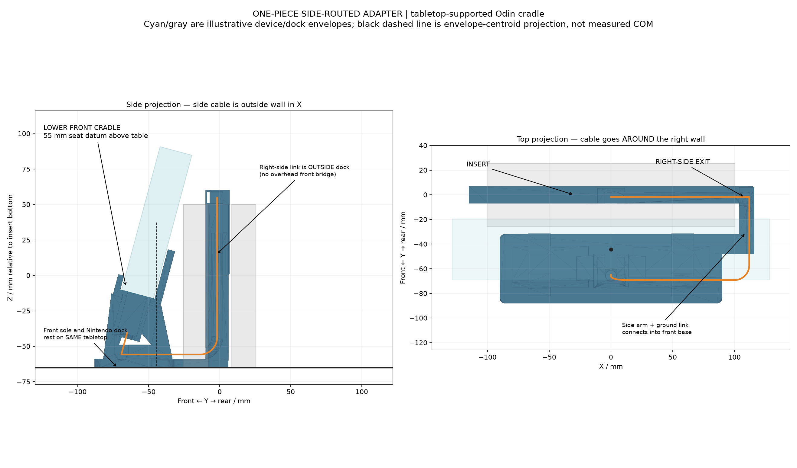

# One-piece side-routed Switch 2 dock adapter for Odin 2 Portal


**One printed piece:** insert it into the Switch 2 dock, run the USB-C extension out the **right side**, and dock the TPU-covered Odin in the lower front cradle. The front base rests on the **same tabletop as the Nintendo dock**. There is **no over-front bridge**, suspended cradle, separate carrier or screw assembly.

A narrow outer-right arm and L-shaped ground link connect the insert to the front base. The full-width bar at the rear is the insert's **seating flange**, not an overhead platform for the Odin. The insert must still reach the Nintendo docking connector; side routing removes unnecessary structure above the front cradle, not that insertion depth.



The top view confirms the cable goes around the dock's right wall. It then runs forward low down, across a lay-in channel and turns up into the Odin's integral USB-C pocket. In the side projection the cable overlaps the dock visually because X is collapsed; it is outside the wall in 3D.

## Files

- **[adapter.stl](adapter.stl): the only printable part**, already in rear-face-down print orientation.
- [odin_portal_dock.scad](odin_portal_dock.scad): editable source of truth.
- [print-orientation.png](print-orientation.png): print layout/orientation.
- [verify_model.py](verify_model.py): regenerate and validate artifacts.
- [validation.json](validation.json): actual geometry results and hashes.
- [reference-measurements.json](reference-measurements.json): measured datums from your uploaded v14 reference.

## Leveling and fit

Nintendo's official dock dimensions are **115 × 201 × 51.2 mm**, including its 2 mm bottom feet. The default `seating_stop_to_table=115` assumes the adapter's stop seats at the overall upper height. With 50 mm insertion depth, the front base's tabletop plane is 65 mm below the insert-bottom datum.

**Before printing, confirm the actual tabletop-to-seating-stop height with your existing adapter inserted.** If not 115 mm, change `seating_stop_to_table` and regenerate. Overall dock height is a proxy, not a measured seating datum. The base must neither hover above the table nor prevent full insertion. Do not force either USB-C connector. Do not add pads underneath the front base without compensating for their thickness.

The uploaded reference provides a 200 mm-wide body, 14.3 mm depth envelope, 50 mm stop plane, a 230 mm flange, ±95 mm lower support positions, and a right-side cable exit at reference height 55 mm. This independently constructed insert uses **199 × 13.8 mm** for deliberate clearance. The original mesh is not imported or redistributed; the uploaded nominal file is not a scan of your manually enlarged printed pocket.

AYN's official Odin size is **257 × 98.6 × 17.2 mm**. Cradle depth is **25.2 mm**, including estimated 3 mm TPU per face and 2 mm extra total fitting clearance. End grips are unconstrained. The seating datum is **55 mm above the tabletop**, 10 mm lower than the preceding tabletop/over-front revision, with a 15° backward lean. There must still be room for your straight male connector and wire underneath.

Print-oriented bounds: approximately **231 × 125 × 94.9 mm**, before support/brim margin.

## Main adjustable parameters

| Parameter | Default | Meaning |
| --- | --- | --- |
| `seating_stop_to_table` | 115 mm | Actual seated-stop height above table; confirm before printing |
| `seat_above_table` | 55 mm | Lower Odin seating datum |
| `side_exit_height` | 55 mm relative to insert bottom | Right-side exit matching reference location; not a hole drilled through Nintendo's case |
| `side_column_x` | 112 mm | Cable descends outside the right wall |
| `side_arm_inner_x` | 104 mm | Arm starts 3.5 mm outside the official dock-width envelope |
| `side_arm_width/depth` | 8 / 16 mm | Narrow side-link structure |
| `front_base_width` | 180 mm | Main front support width |
| `front_base_front/rear` | −88 / −32 mm | Main base is in front of dock; side toe wraps around its corner |
| `front_base_thickness` | 6 mm | Ground support thickness |
| `insert_width/depth_clearance` | 1 / 0.5 mm total | Reduction from reference envelope |
| `insertion_height` | 50 mm | Blade depth to stop |
| `seat_y` | −70 mm | Front cradle position |
| `tpu_per_face`, `fit_clearance` | 3 / 2 mm | Assumed TPU allowance and total extra seat clearance |
| `female_width/depth/height` | 22 × 14 × 30 mm | Oversized dock-side housing pocket |
| `male_width/depth/height` | 22 × 14 × 29 mm | Oversized Odin-side housing pocket |
| `cable_bend_radius` | 12 mm | Rounded cable turns; check actual cable minimum radius |
| `wire_diameter_allowance` | 8 mm | Carved channel allowance; actual clearance test uses a 6 mm wire |

Connector pockets are generous silicone-adjustment allowances, **not measured LEIRUI housing sizes**. Significant parameter changes require regeneration and all checks. Actual slot placement, case contours, vents and ports are not fully measured; check that the side arm leaves them accessible.

## Cable installation

Use your working **LEIRUI USB4 male/female extension, ASIN B09L4Q85CH**. You reported charging and TV output working; that electrical behavior was not independently tested here.

1. Remove the old printed insert. This one-piece unit replaces it.
2. With power disconnected, place the female housing in the lower insertion-blade pocket and align its socket with the Nintendo dock's upward-facing plug. Adjust seating height/position before fixing it; do not use the plug to carry structural load.
3. Lay the wire in the front-open insert channel, bend it toward the **right-side exit**, and lay it into the outer side-arm groove.
4. Route down outside the Nintendo right wall, then forward along the ground link. Lay the cross-feed into its open slots below the Odin; no preterminated plug needs threading through a sealed wire-sized tunnel.
5. Seat the male housing in the integral Odin pocket, aligned with the 15° cradle. Bed the housings using electronics-safe non-corrosive neutral-cure silicone. Keep it out of ports, contacts and vents; use a protected jig and let it cure completely. Retain excess cable away from ventilation.
6. Insert the whole unit into the Nintendo dock until the stop seats, with both the Nintendo dock and the printed base on the table. Place the TPU-covered Odin in the cradle; its weight travels through the front legs into the tabletop, not through its USB-C connector.
7. Test fit, gentle docking cycles, charging/video, sliding/tipping, ventilation and temperature before unattended use. Do not force a misaligned connector or use silicone to compensate for a leveling mismatch.

## Printing


Print at **100% scale** in the exported **rear insert face-down** orientation, not in its installed tabletop orientation. Suggested starting settings: PETG, 0.2 mm layers, 4–5 walls, 25–35% infill, brim if necessary.

Supports are needed for the projecting front cradle/base, side link, pocket roofs and some channel regions. Inspect slicer layer/support preview and ensure support removal is possible. Completely clean cable loading slots, connector pockets and contact surfaces; deburr square edges. Thin pads on device-contact faces can protect the TPU. Settings, strength and support removal are not physically tested.

## Rebuild and checks

```sh
openscad --render -D 'part="adapter"' -o adapter.stl odin_portal_dock.scad
uv run --python 3.11 --with trimesh --with scipy --with networkx --with matplotlib --no-project python verify_model.py
```

The verifier also regenerates previews. Set `OPENSCAD_BIN` if needed; PNG rendering requires a graphics display/OpenGL context, which may be virtual on Linux.

Selectors: `adapter`, `assembled`, `placement`, `cable_check`, `dock_clearance_check`, `device_clearance_check`, `table_check`, `cable_device_check`, `cable_dock_check`.

Verified with actual exports:
- Exactly one connected, watertight, positive-volume printable solid.
- Docking-blade envelope checked at four heights; external side link excluded from those blade bounds.
- Front sole matches modeled Nintendo tabletop; side link stays outside the official width envelope and has no collision with simplified dock walls.
- Complete 6 mm wire path clears print, device, dock walls and space below table.
- Device envelope clears print; only 0.02 mm of intentional seat-contact plane is excluded numerically.
- Device-envelope centroid projects inside the front sole, with approximately **12.3 mm** front/back margin. This is a geometric proxy, **not measured real-device COM or a loaded tipping-force test**.
- Source/STL hashes and actual OpenSCAD results are recorded. Empty collision exports are expected and handled explicitly. Previews inspected in a headless display.

**Still unverified:** real seated-stop/table datum, physical case/connector fit, loaded balance, print strength, actual port/vent clearance, electrical operation and thermal performance. `physical_fit_verified` and `actual_loaded_balance_verified` remain false.

## References

- [Official Nintendo dock specifications](https://www.nintendo.com/sg/hardware/switch2/specs/index.html).
- [AYN Odin 2 Portal](https://www.ayntec.com/products/odin2-portal), [official size/specification image](https://www.ayntec.com/cdn/shop/files/odin2-portal_7_a9a0c473-3e93-4c62-885f-e1e904205da8.jpg?v=1737092883).
- [Dock adapter by adimaniac](https://makerworld.com/en/models/1583137-nintendo-switch-2-dock-usb-c-extension-adapter): supplied nominal v14 STL inspected for datums and existing right-side exit only; original not copied/imported/redistributed.
- [Odin stand by Martin Mesa](https://www.printables.com/model/1417821-odin-2-portal-stand): visual/layout reference, original mesh not included.

Original OpenSCAD construction; not an official Nintendo, AYN or dbrand product.
