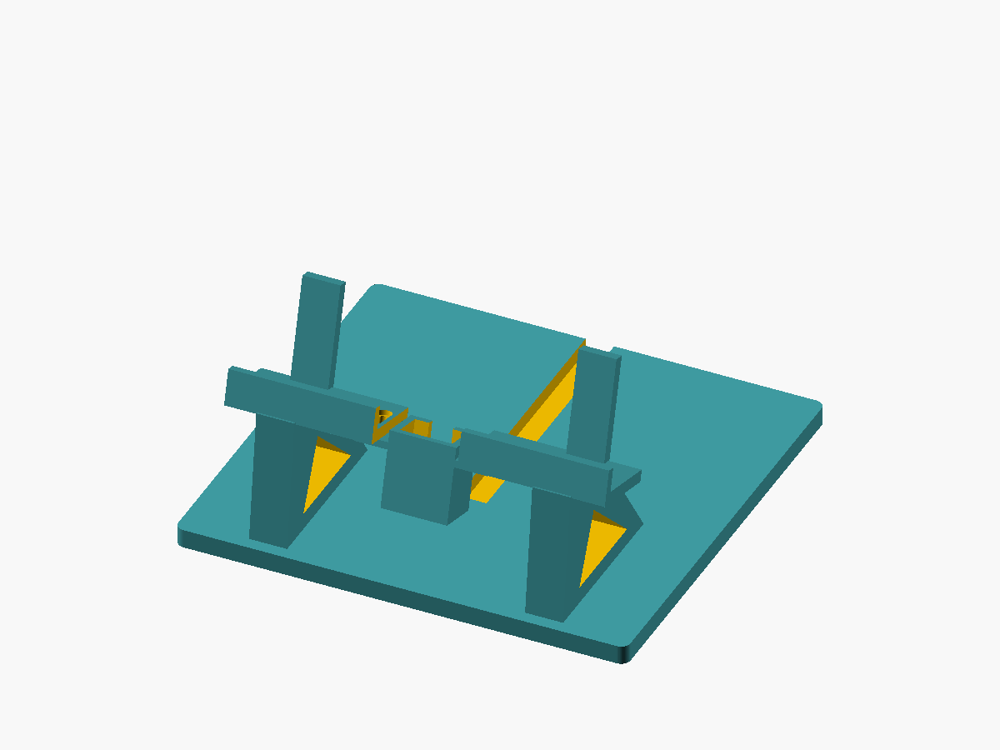
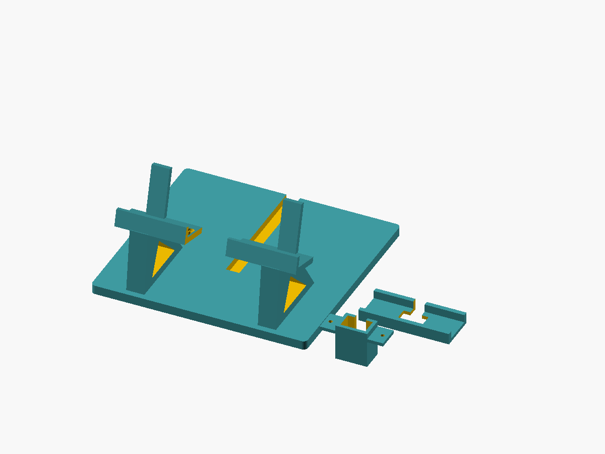

# Odin 2 Portal front cradle for the Switch 2 dock



**Original OpenSCAD fit-test prototype. Not physically printed or fit-tested.**

This cradle holds the Odin 2 Portal with its official AYN TPU grip immediately in front of the Switch 2 dock. It shares a base with the existing dock and routes an extension cable underneath. **Keep your existing, manually enlarged MakerWorld insert inside the dock:** this model is its companion, not a replacement insert or a literal merge of third-party meshes.

The user's LEIRUI USB4 extension, Amazon ASIN **B09L4Q85CH**, is reported to provide video and charging with this device/dock. Electrical compatibility has not been independently tested.

## Files

| File | Purpose |
| --- | --- |
| [odin_portal_dock.scad](odin_portal_dock.scad) | Parametric source of truth; default view is the print layout |
| [front-cradle.stl](front-cradle.stl) | Main cradle and rear dock platform |
| [usb-carrier.stl](usb-carrier.stl) | Removable oversized male USB-C holder |
| [fit-gauge.stl](fit-gauge.stl) | Small TPU-gap and connector-pocket test |
| [layout.png](layout.png) | All printable parts shown separately |
| [validation.json](validation.json) | Exported mesh/connectivity/collision checks |



## Dimensions and adjustable parameters

AYN's official specification image gives **257 × 98.6 × 17.2 mm** for the Odin 2 Portal. Its grip-inclusive thickness and exact port coordinates are not supplied in that image.

| Parameter | Default | Meaning |
| --- | --- | --- |
| `odin_thickness` | 17.2 mm | Official body thickness |
| `tpu_per_face` | 3 mm | Estimated TPU allowance on each face; not a published AYN grip measurement |
| `fit_allowance` | 2 mm total | Additional fitting clearance |
| `seat_gap` | 25.2 mm, calculated | Clear depth between front and rear contacts |
| `tilt` | 15° | Rearward lean from vertical |
| `seat_height` | 65 mm | Seat datum above the build plate |
| `support_width` | 160 mm | Central support; end grips remain unconstrained |
| `base_width`, `base_depth` | 190 × 180 mm | Main print footprint, before brim/support margin |
| `base_height` | 8 mm | Rear platform thickness |
| `pocket_width/depth/height` | 22 × 14 × 29 mm | Oversized connector cavity, not measured LEIRUI dimensions |
| `mount_travel` | 10 mm total | Fore/aft carrier adjustment |
| `mount_pitch` | 46 mm | Two M3 carrier mounting points |
| `wire_outlet` | 9 mm | Carrier cable exit |
| `cable_channel_width/depth` | 12 × 6 mm | Groove under existing dock |

Main print height is approximately **100 mm**. The rear is open except for two narrow, low contact rails; check actual ventilation clearance on your device. The USB position is approximately centered from official imagery, not a measured datum. Silicone bedding sets connector height and position. Some brace geometry uses explicit coordinates in `stand()`; inspect the whole assembly after major parameter changes.

## Hardware and assembly

- Your already-fitting dock insert and working male/female USB-C extension.
- Two **M3 × 12 mm low-profile screws** and nuts for the removable carrier. Heads must fit the 2 mm-deep shelf recesses; verify no hardware projects into the handheld's seating area.
- Electronics-safe **non-corrosive neutral-cure silicone** to bed the connector housing.
- Optional felt/silicone contact pads, rubber feet and a removable dock-retention strap.

1. **Print the fit gauge and carrier first.** Test the TPU-covered center bottom edge and the actual male connector housing. The gauge checks nominal clearance, not full tilted-seat fit or port position.
2. Put the Nintendo dock on the rear platform, approximately 100 mm from the platform's front. There is no dock-specific clamp; use non-slip pads/retention if needed and test stability. The dock supplies ballast.
3. Leave the modified insert in the dock. Route its cable over an accessible edge, down behind the dock, through the rear base groove, then forward beneath the raised cradle. The vertical run remains accessible, not fully enclosed. Do not drill or modify the Nintendo dock. Check the cable is not pinched under it.
4. Fasten the carrier under the shelf. Its flange meets the shelf underside; mounting slots allow fore/aft alignment.
5. With power disconnected, align the male plug and place the Odin on the seat. **The seat/pads must carry the weight, not the USB-C connector.** Do not force docking or bend the port to achieve alignment.
6. Secure the housing with silicone while preserving the required engagement height. Keep silicone out of contacts, ports and vents. Use a masked positioning jig; do not cure against an unprotected handheld. Let it cure fully before reconnecting.
7. Check charging/video, gentle insertion/removal, airflow, temperature and tipping resistance. Stop if the port bears weight, seating needs force, signal is intermittent or the cable is pinched.

## Printing

Print all STLs at **100% scale** in their exported orientations:

- **Main cradle:** broad base down. Enable build-plate/tree supports for the elevated shelf and inspect all overhangs in your slicer. Triangular brace openings may also need support according to your printer's capability.
- **Carrier:** bottom down as exported. Its elevated mounting flange may need supports; keep the cable cavity and screw holes clear.
- **Gauge:** flat underside down; normally no supports.

Suggested starting settings: PETG, 0.2 mm layers, 4 walls, 20–30% infill. These settings are not physically tested. Allow bed space for the 190 × 180 mm footprint plus brim and supports. Deburr edges and remove every support fragment from contact/connector areas.

## Regeneration and validation

```sh
openscad --render -D 'part="stand"' -o front-cradle.stl odin_portal_dock.scad
openscad --render -D 'part="carrier"' -o usb-carrier.stl odin_portal_dock.scad
openscad --render -D 'part="gauge"' -o fit-gauge.stl odin_portal_dock.scad
openscad --render --autocenter --viewall --projection=ortho --imgsize=1200,900 --colorscheme=Tomorrow -D 'part="assembled"' -o preview.png odin_portal_dock.scad
openscad --render --autocenter --viewall --projection=ortho --imgsize=1200,900 --colorscheme=Tomorrow -D 'part="layout"' -o layout.png odin_portal_dock.scad
```

Selectors: `stand`, `carrier`, `gauge`, `assembled`, `layout`, `placement`, `collision_check`. `placement` adds background device/dock boxes only for illustration: **dock dimensions are unverified**. `collision_check` should have no positive-volume solid; coplanar mounting faces are intentional contact.

Actual checks: all three STLs generated with OpenSCAD 2021.01 without errors, each watertight and positive-volume with one connected solid. Carrier alignment was checked using the assembled transforms and a Manifold Boolean intersection of exported meshes. Intersection was below **0.01 mm³** (numerical tolerance for tessellated shared contact faces), not meaningful structural overlap. M3 through-holes, recessed heads, slots and a mounting flange are modeled explicitly. Assembly/layout previews inspected. No physical fit, live electrical, insertion-force or thermal test performed. The render was generated in a headless virtual display; interactive review on the user's display was not possible.

## References and licensing scope

- [Official AYN product](https://www.ayntec.com/products/odin2-portal) and [current specification image](https://www.ayntec.com/cdn/shop/files/odin2-portal_7_a9a0c473-3e93-4c62-885f-e1e904205da8.jpg?v=1737092883).
- [Dock extension adapter by adimaniac](https://makerworld.com/en/models/1583137-nintendo-switch-2-dock-usb-c-extension-adapter): its author lists a 6 × 12 mm female housing; the user's copy is manually enlarged. Standard Digital File License restricts redistribution/remixing. **Its source/mesh is not imported, modified or included.**
- [TPU-compatible Odin stand by Martin Mesa](https://www.printables.com/model/1417821-odin-2-portal-stand): layout reference for an inclined, low-contact cradle, licensed Creative Commons Attribution–NonCommercial. Its mesh was not downloaded/imported; this model does not claim its original exact fit.

The included geometry is independently constructed in OpenSCAD. This is not an official Nintendo, AYN or dbrand product.
