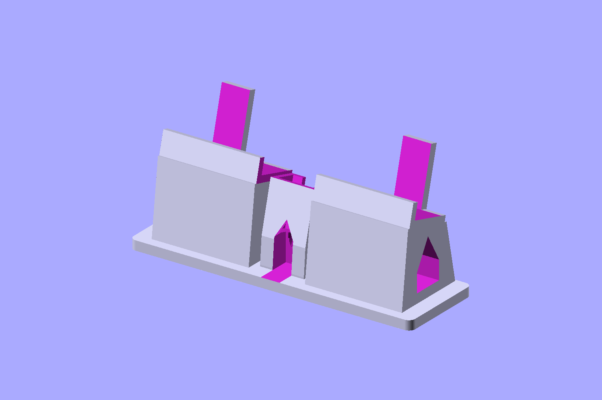
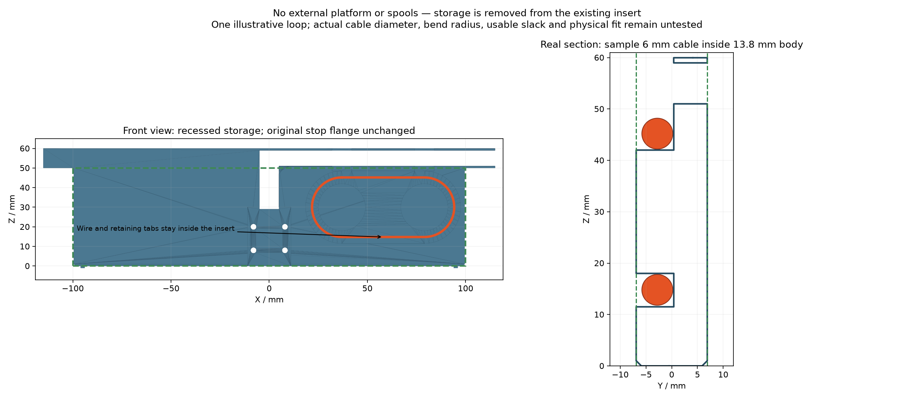
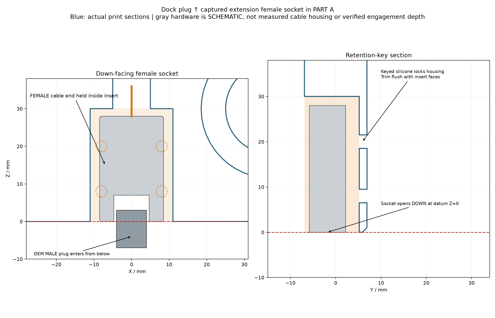
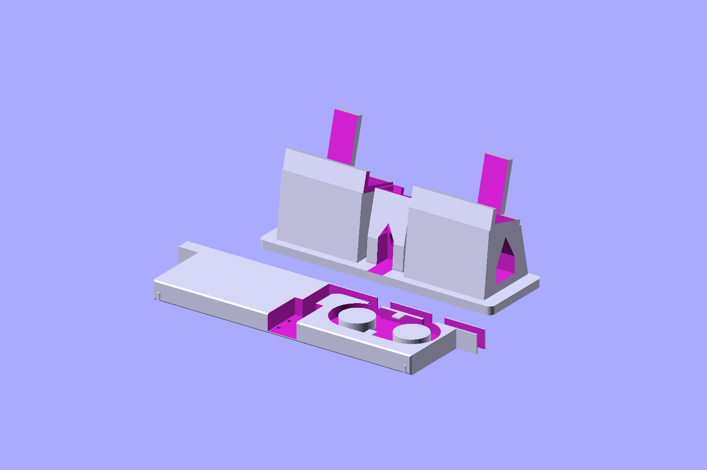

# Compact Switch 2 insert + easier-print Odin 2 Portal cradle


**Two printed parts connected only by your existing USB-C extension:**

1. **Dock insert:** holds the extension's female socket facing DOWN into Nintendo's upward-facing USB-C plug. Cable storage is now RECESSED into the existing insertion body. No external platform, tall spool or added thickness.
2. **Independent cradle:** supports the TPU-covered Odin and holds the male plug. The seat and connector cup now have continuous base support instead of floating mounting wings. Steep pitched openings replace support-heavy window ceilings.

No rigid arm or matched-height requirement. Place the cradle within available cable reach.

## Printable files

| File | Exported dimensions (mm) | Orientation |
| --- | --- | --- |
| [adapter.stl](adapter.stl) | 230 × 61 × 13.8, including original stop flange | Rear insert face down, as exported |
| [cradle.stl](cradle.stl) | 180 × 56.5 × 83.3 | Broad base down, as exported |

The insertion body remains **199 × 13.8 × 50 mm**, reduced from the supplied reference's nominal 200 × 14.3 mm envelope for clearance. The 230 mm width is the existing stop flange, not a new spool. Exact physical dock fit remains untested.

## Cradle: easier base-down printing



- Continuous supports reach the seat from the base.
- The USB-C cup has continuous base support; elevated mounting wings were removed.
- Side openings and the front cable passage have **60° pitched roofs**, measured from horizontal, leaving margin above a 45° support threshold.
- Wire enters through the front-open passage, instead of crossing the seat supports through a horizontal side tunnel.
- Case clearance remains 25.2 mm, lean 15°, and seating datum 55 mm above the cradle's own base.

**Real slicer comparison:** PrusaSlicer 2.9.2, 0.4 mm nozzle, 0.2 mm layers, four walls, 20% infill, automatic supports at 45°, ordinary bridges excluded from supports. The previous cradle generated **12,885.15 mm of support filament**; this redesigned cradle generated **zero support extrusion moves** under the same settings. See [slicing-validation.json](slicing-validation.json) and [check_slicing.py](check_slicing.py).

This is a generic slicing test, **not a physical print or your printer's tuned profile**. Use the base-down orientation and inspect your own layer preview and bridging/cooling settings. Diagnostic G-code stays in temporary local files; no printer-specific G-code is distributed.

## Recessed cable storage: preserve dock fit



The former external deck and large spool flanges are gone. Storage is removed from the right half of the existing body, leaving rounded internal islands and short flush retainers. The outer silhouette does not grow.

Full-diameter CAD checks show:

- A sample **6 mm cable loop** clears the plastic.
- The sample lies entirely inside the **199 × 13.8 × 50 mm insertion body**.
- Insert plus sample loop remains inside the original reference outer envelope, including the unchanged stop flange.
- The female socket datum, silicone-key holes and right-side lead exit remain.

The illustrated loop is a **storage-space test**, not a measured end-to-end routing model or promise of usable wrap capacity. Actual cable diameter, stiffness, minimum bend radius and housing dimensions remain unmeasured. Do not stack loops or leave wire/silicone projecting outside the insertion envelope. If the wire cannot lie flush or needs a larger bend, do not force the insert into the dock.

Position the cradle first; leave both connector leads relaxed. Tuck only spare wire into the recess and unwind/reposition as needed. A partial wrap may be all the cable can spare. Do not tension either USB-C port.

## USB-C installation and fit



```text
Nintendo dock upward MALE plug
              ↑
Extension downward FEMALE socket retained in insert
              → adjustable wire / recessed slack storage
Extension upward MALE plug retained in separate cradle
              → Odin 2 Portal
```

The female receiving-face datum is X=0, Y=−1.8 mm, Z=0, facing down. The pocket shoulder and four silicone-key holes retain the housing. Align the actual cable and test gentle engagement before curing neutral-cure, electronics-safe silicone. Keep contacts free; trim cured silicone flush. Neither connector should carry the insert/device weight.

Your extension is ASIN **B09L4Q85CH**; you reported video and charging working through this dock. That does not verify the printed mount. Female/male pockets remain oversized at **22 × 14 × 30 mm** and **22 × 14 × 29 mm** for silicone adjustment—not measured cable housing dimensions.

AYN's bare Odin 2 Portal is **257 × 98.6 × 17.2 mm**. The 25.2 mm seat gap assumes 3 mm TPU per face plus 2 mm total clearance. Actual TPU grip fit, loaded stability, thermal behavior and electrical engagement with the printed mount remain untested.

## Printing



Print at **100% scale**. PETG, 0.2 mm layers, four or more walls and 20–30% infill are starting suggestions, not physically tested settings.

- **Cradle:** broad base down. No supports were generated under the documented test profile. Check your own slicer; ordinary bridging is still required in small local features.
- **Adapter:** rear face down. Check socket/flush-retainer overhangs and use localized supports where needed. Clear all debris. The cradle's zero-support result does **not** apply to the adapter.

## Source and regeneration

[odin_portal_dock.scad](odin_portal_dock.scad) is the source. Selectors: `adapter`, `cradle`, `assembled`, `layout`. Installed placement is illustrative; dock height does not set either native printable part's geometry.

Important parameters: `insert_width_clearance=1`, `insert_depth_clearance=.5`, `female_socket_face_z=0`, `winder_core_radius=12`, `winder_spacing=42`, `winder_x=58`, `winder_center_z=30`, `coil_test_diameter=6`, `window_roof_angle=60`, `window_half_width=10`, `tpu_per_face=3`, `fit_clearance=2`, `tilt=15`, `seat_above_table=55`. Do not enlarge storage beyond the reference envelope or scale the entire STL to fit a smaller bed.

```sh
openscad --render -D 'part="adapter"' -o adapter.stl odin_portal_dock.scad
openscad --render -D 'part="cradle"' -o cradle.stl odin_portal_dock.scad
uv run --python 3.11 --with trimesh --with scipy --with networkx --with matplotlib --no-project python verify_model.py
SLICER_BIN=/path/to/prusa-slicer python3 check_slicing.py
```

Set `OPENSCAD_BIN` if needed. PNG generation requires DISPLAY/OpenGL, optionally virtual. [verify_model.py](verify_model.py) exports meshes/previews and writes [validation.json](validation.json): two watertight positive-volume solids; plug entry; dock, cable, stored-loop, device and tabletop clearances; strict stored-cable/body envelope; reference outer envelope; and independence from preview-height changes. [reference-measurements.json](reference-measurements.json) records reference datums. Headless renders were visually inspected; no interactive GUI or physical print review is claimed.

## References

- [Nintendo Switch 2 specifications](https://www.nintendo.com/sg/hardware/switch2/specs/index.html): outer dock 115 × 201 × 51.2 mm, illustrative context only—not an exact slot drawing.
- [AYN Odin 2 Portal](https://www.ayntec.com/products/odin2-portal).
- User-supplied `Switch+2+Dock+Adapter+v14.stl`, [adimaniac listing](https://makerworld.com/en/models/1583137-nintendo-switch-2-dock-usb-c-extension-adapter): fit datums only; original mesh untouched and not redistributed.

Original OpenSCAD construction; not an official Nintendo, AYN or dbrand product.
