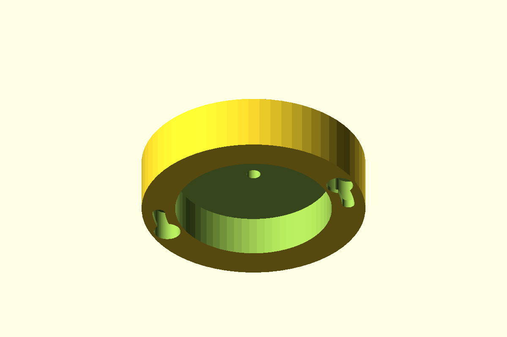

# Round Twist-Lock Ceiling Mount

A round cable mount with two opposing ramped twist-lock slots. The screw heads enter through the large openings, then tighten against the internal lips as the mount rotates 20 degrees.

## Files

| File | Description |
| --- | --- |
| [`round_twist_lock_ceiling_mount.scad`](round_twist_lock_ceiling_mount.scad) | Parametric OpenSCAD source |
| [`mount.stl`](mount.stl) | Ready-to-print mount |
| [`drilling_template.scad`](drilling_template.scad) | Independent drilling-template source |
| [`drilling_template.stl`](drilling_template.stl) | Flat guide for the screw and cable-hole locations |
| [`preview.png`](preview.png) | Underside render showing the locking slots |

## Interactive 3D preview

- [Open the mount in the 3D viewer](mount.stl)
- [Open the drilling template in the 3D viewer](drilling_template.stl)

## Dimensions and hardware

- Base: 80 mm diameter x 20 mm tall
- Cable neck: 14 mm diameter x 15 mm tall
- Internal cavity: 56 mm diameter
- Cable opening: 5 mm diameter
- Fasteners: two M4 screws on a 34 mm radius
- Maximum modeled screw-head clearance: 9.5 mm
- Locking rotation: 20 degrees

## Printing

- Print in the modeled orientation with the hollow side on the build plate.
- Supports are recommended beneath the internal roof and twist-lock channels.
- Print the drilling template flat; it does not require supports.
- The template's outer guide centers are 68 mm apart and its center guide marks the cable hole.
- Verify the screw-head dimensions and locking fit before installation.
- Adjust `shaft_dia`, `head_dia`, `lip_start`, and `lip_end` to tune the hardware fit.

This printed part is not a certified structural or electrical component. Select suitable material and fasteners, and validate it for the intended load and environment.
