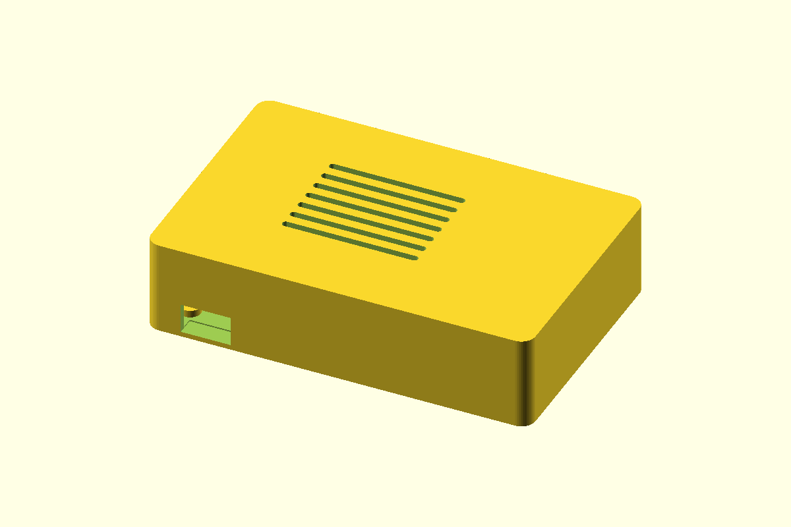

# Raspberry Pi 4 USB-C Case

A compact two-piece Raspberry Pi 4 Model B enclosure. Only the USB-C power connector is exposed; install the microSD card before closing the case.

The board is retained by two split snap-pegs and two locating pins. The lid uses an internal alignment rim and horizontal positive-lock snap hooks designed to flex along the print layers.

## Files

| File | Description |
| --- | --- |
| [`rpi4_usb_c_case.scad`](rpi4_usb_c_case.scad) | Parametric OpenSCAD source |
| [`base.stl`](base.stl) | Case base |
| [`lid.stl`](lid.stl) | Snap-fit lid |
| [`preview.png`](preview.png) | Assembled render |

## Printing

- Print the base upright.
- Print the lid with its flat top on the build plate.
- No supports are required.
- Main case dimensions are 96.2 x 63 x 23.5 mm.
- The USB-C opening is 12.5 x 7.5 mm for cable bodies up to 11 x 6 mm.

The model includes 1 mm clearance beyond the USB connector faces and ventilation slots above the board.
