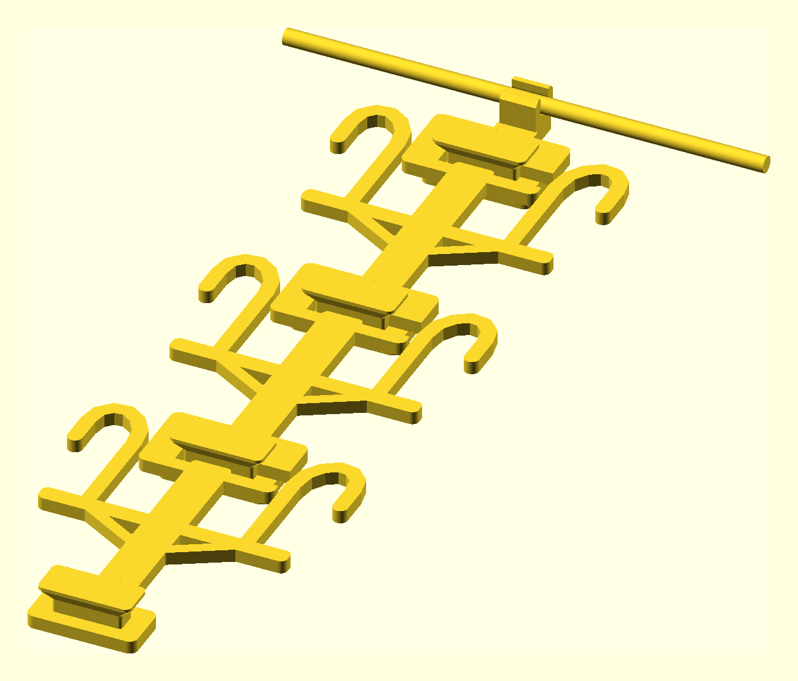

# Modular Shoe Hanger

A two-part modular hanger for **three pairs of shoes**:

| Print | Quantity | Purpose |
| --- | ---: | --- |
| [`hanger-adapter.stl`](hanger-adapter.stl) | 1 | Hooks onto the bottom bar of a sturdy clothes hanger |
| [`shoe-level.stl`](shoe-level.stl) | 3 | Each identical level holds one pair and supports the next level |

The default shoe supports are sized for men's US size 10 sneakers. Shoe
length does not need to fit inside the printed part: each shoe slides onto
one of the two 90 mm heel supports and hangs toe-down.

## Assembly

1. Push the orange adapter onto the center of the clothes hanger's
   horizontal bottom bar. The bar enters the adapter from the front and
   snaps into the transverse socket.
2. Raise one shoe level so the side opening in its top receiver lines up
   with the wide tongue on the adapter.
3. Slide the level sideways over the tongue until it is centered.
4. Let the level drop 9 mm. The tongue moves into the upper pocket, where
   gravity prevents it from sliding back toward the side opening.
5. Attach the other two identical levels the same way.
6. Slide one shoe heel opening over each long J-shaped support. The
   shoes hang toe-down, parallel to the vertical center spine.

Load the first and third pairs from one face and the middle pair from the
opposite face. Alternating faces keeps adjacent size-10 shoes from
touching while the first and third pairs remain 340 mm apart.

## Reinforced connector

Each connection uses a 42 mm-wide bayonet tongue rather than a small
button or snap tab. The tongue passes through the full 8 mm receiver,
while a 56 mm retaining cap traps the receiver between two broad faces.
Vertical load is carried by the full-width upper wall of the locked
pocket, and both the adapter and shoe levels use 24 mm-wide overlapping
spines into their connector pads.

The fit includes 0.4 mm clearance per side around the tongue and 0.5 mm
total clearance through the receiver thickness.

## Dimensions

- Hanger adapter: approximately 66 mm wide, 79 mm tall, and 29 mm deep.
- Shoe level: approximately 169 mm wide, 211 mm tall, and 25.5 mm deep
  at the connector cap.
- Shoe support spacing: 96 mm center-to-center.
- Usable heel support length: approximately 90 mm.
- Vertical spacing between levels: 170 mm.
- Complete three-level chain: approximately 580 mm from the hanger bar
  to the final connector.
- Default hanger bottom-bar diameter: 10 mm. The adapter socket runs
  horizontally along the bar while the shoe levels remain vertical.

Use a sturdy plastic or wooden clothes hanger. A thin wire hanger is not
recommended for the combined weight of three pairs.

## Printing

- Print both STL files exactly as supplied, with their large flat face on
  the bed.
- No supports are required. The connector's wide retaining cap grows
  from the tongue on a printable 45-degree ramp.
- PETG is recommended for the hanger clip and load-bearing connectors.
- Use at least 5 walls/perimeters and 30% infill.

## Files

| File | Description |
| --- | --- |
| [`shoe_hanger.scad`](shoe_hanger.scad) | Parametric OpenSCAD source |
| [`hanger-adapter.stl`](hanger-adapter.stl) | One hanger attachment |
| [`shoe-level.stl`](shoe-level.stl) | Repeatable one-pair level |
| [`preview.png`](preview.png) | Adapter with three assembled levels |

## Adjustable parameters

- `hanger_bar_d` and `hanger_bar_clearance`: fit for the existing
  clothes hanger's bottom bar.
- `hanger_socket_snap`: grip at the socket entrance.
- `hanger_socket_width`: contact width along the horizontal hanger bar.
- `shoe_hook_x`: half of the spacing between the two shoes.
- `shoe_hook_outer_x`, `shoe_hook_top_y`, and `shoe_hook_tip_y`: heel
  support shape.
- `level_pitch`: vertical spacing between identical levels.
- `connector_clearance`: per-side clearance around the bayonet tongue.
- `connector_depth_clearance`: total clearance through the receiver.
- `connector_drop`: distance the level drops into its gravity lock.

Set `part` to `"hanger_adapter"`, `"shoe_level"`, or `"assembled"` when
rendering from OpenSCAD.
